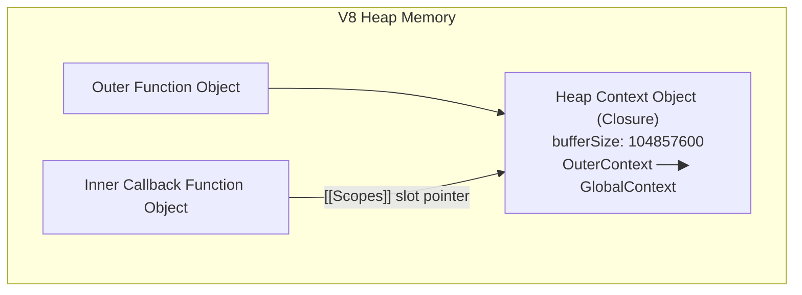

# Closures

## 1. 💡 Intuition & ELI5 Analogy

Think of a closure as a backpack attached to a function. When a function is created inside another function, it packs up every variable from its surrounding (outer) environment that it might need into its backpack. Even if the outer function finishes executing and leaves the stack, the inner function keeps its backpack wherever it goes. Anyone holding a reference to that inner function can open the backpack and access or modify those preserved variables.

A classic real-world trap occurs when callbacks capture references to large objects or loop variables in long-lived event listeners or timers, inadvertently keeping massive memory structures alive indefinitely:

```typescript
// ❌ Naive / Broken State: Unintended closure holding onto a massive buffer
function setupLeakyEventListener() {
  const hugeBuffer = Buffer.alloc(100 * 1024 * 1024); // 100MB buffer

  // Callback closes over 'hugeBuffer' even though it only needs 'hugeBuffer.length'
  setInterval(() => {
    console.log("Buffer size:", hugeBuffer.length); // Retains 100MB in memory forever!
  }, 5000);
}
```

```typescript
// ✅ Correct State: Explicitly extracting primitive values to decouple closures
function setupCleanEventListener() {
  const hugeBuffer = Buffer.alloc(100 * 1024 * 1024); // 100MB buffer
  const bufferSize = hugeBuffer.length; // Extract primitive value

  // Callback closes ONLY over 'bufferSize' (primitive number)
  // 'hugeBuffer' is unreferenced after setup, cleanly GC'd!
  setInterval(() => {
    console.log("Buffer size:", bufferSize);
  }, 5000);
}
```

---

## 2. 🔬 Deep Architectural Breakdown & Engine Mechanics

Under the hood in V8, closures are implemented via internal **`Context` objects** stored in the `[[Scopes]]` property of function objects.

### V8 Internal Representation of Functions and Contexts

When V8 parses a function declaration:
1. Every JS Function object in V8's heap contains an internal slot named `[[Scopes]]`.
2. `[[Scopes]]` contains an array of pointers to `Context` objects corresponding to the outer lexical environments in which the function was created.

When an outer function returns an inner function:
- Standard stack frames allocated on the C++ stack for local variables are destroyed when a function returns.
- **However**, if V8's compiler (Ignition/TurboFan) detects during AST scope analysis that an inner function references a variable from an outer function, V8 allocates that outer variable on the **V8 Heap** inside a specialized `Context` object, rather than on the transient stack frame!



### Shared Context Hazards in V8

A critical engine nuance: **All inner functions created within the same parent execution context share the SAME Context object.**

If function `outer()` declares `var a = 100MB_Buffer` and `var b = 5`, and defines two inner functions `fnA()` (accesses `a`) and `fnB()` (accesses `b`):
- V8 creates ONE shared `Context` object for `outer()` containing BOTH `a` and `b`.
- If you export or retain `fnB()` (e.g. in a global event bus) and discard `fnA()`, `fnB()`'s `[[Scopes]]` slot points to that shared `Context` object.
- Because `a` is stored in that shared `Context` object, **`100MB_Buffer` CANNOT be garbage-collected as long as `fnB()` is alive**, even though `fnB()` never reads `a`!

---

## 3. 💻 Complete Production Code + Line-by-Line Annotations

Below is a production TypeScript module (`closure-exercises.ts`) demonstrating partial application, currying, module state pattern, and memory-safe callback generation.

```typescript
/**
 * closure-exercises.ts
 * Demonstrates closure encapsulation, partial application, currying,
 * and memory-conscious callback creation in Node.js backend services.
 */

export interface CacheStats {
  hits: number;
  misses: number;
  size: number;
}

/**
 * Creates an in-memory cache with TTL using closures for state isolation.
 */
export function createMemoizedCache<TInput, TOutput>(
  computeFn: (arg: TInput) => TOutput,
  ttlMs: number
) {
  // Encapsulated closure state allocated on V8 Heap Context
  const cacheMap = new Map<string, { value: TOutput; expiresAt: number }>();
  let hits = 0;
  let misses = 0;

  return {
    /**
     * Look up or compute value using closed-over state.
     */
    get: (keyInput: TInput): TOutput => {
      const key = String(keyInput);
      const now = Date.now();
      const cached = cacheMap.get(key);

      if (cached && cached.expiresAt > now) {
        hits++;
        return cached.value;
      }

      misses++;
      const freshValue = computeFn(keyInput);
      cacheMap.set(key, {
        value: freshValue,
        expiresAt: now + ttlMs,
      });

      return freshValue;
    },

    /**
     * Purges expired entries from the closed-over Map.
     */
    purgeExpired: (): number => {
      const now = Date.now();
      let purgedCount = 0;

      for (const [key, entry] of cacheMap.entries()) {
        if (entry.expiresAt <= now) {
          cacheMap.delete(key);
          purgedCount++;
        }
      }

      return purgedCount;
    },

    getStats: (): CacheStats => ({
      hits,
      misses,
      size: cacheMap.size,
    }),
  };
}

/**
 * Partial Application Utility using closures.
 * Binds initial arguments to a worker function.
 */
export function buildUrlFetcher(baseUrl: string, defaultHeaders: Record<string, string>) {
  // Sanitize base URL in outer function environment once
  const normalizedBase = baseUrl.endsWith("/") ? baseUrl.slice(0, -1) : baseUrl;

  // Inner function closes over 'normalizedBase' and 'defaultHeaders'
  return (endpoint: string, queryParams?: Record<string, string>): string => {
    const cleanEndpoint = endpoint.startsWith("/") ? endpoint : `/${endpoint}`;
    let fullUrl = `${normalizedBase}${cleanEndpoint}`;

    if (queryParams && Object.keys(queryParams).length > 0) {
      const searchParams = new URLSearchParams(queryParams);
      fullUrl += `?${searchParams.toString()}`;
    }

    return fullUrl;
  };
}
```

---

## 4. ⚠️ Real-World Failure Modes & Security Edge Cases

### 1. Accidental Memory Retention via Shared Context
- **Failure Mode**: Retaining a small callback (e.g. error logger) in a global emitter while a sibling closure in the same parent scope holds a massive array or database connection object, leading to unexplained heap leaks in production.
- **Prevention**: Nullify heavy references (`heavyData = null`) or move small callbacks into separate helper functions to prevent shared context inclusion.

### 2. Closure Capture in Asynchronous Loops (`var` vs `let`)
- **Failure Mode**: Using `var` or outer-scoped reassignable variables inside asynchronous loops (`for`, `forEach`, or `setTimeout`). All callbacks reference the single outer variable, evaluating to the final loop value instead of the value during that iteration.
- **Prevention**: Use `let` in `for` loops (creates per-iteration block bindings) or `Array.prototype.map`.

### 3. Stale Closure Data in Long-Lived Request Handlers / Subscribers
- **Failure Mode**: A closure created during server initialization captures config values or auth tokens. If config updates dynamically at runtime, the closure continues reading the stale closed-over variables.
- **Prevention**: Pass dynamic state references via getters or container objects (`configHolder.get()`) rather than closing over primitive snapshot variables.

---

## 5. 🛠️ Hands-On Guided Exercise & Reference Solution

### Exercise Task
Write a TypeScript utility `createBatchProcessor<T>(batchSize: number, flushCallback: (batch: T[]) => void)` that returns a function `addItem(item: T): void`.

**Requirements**:
1. Use closures to encapsulate the pending item queue without exposing it on global scope.
2. Automatically trigger `flushCallback` with a copy of the batch once `batchSize` is reached, resetting the inner queue.
3. Include a `flushRemaining(): void` method on the returned object to flush any leftover items on shutdown.

### Reference Solution

```typescript
export interface BatchProcessor<T> {
  addItem: (item: T) => void;
  flushRemaining: () => void;
  getPendingCount: () => number;
}

export function createBatchProcessor<T>(
  batchSize: number,
  flushCallback: (batch: T[]) => void
): BatchProcessor<T> {
  let pendingQueue: T[] = [];

  return {
    addItem: (item: T): void => {
      pendingQueue.push(item);

      if (pendingQueue.length >= batchSize) {
        const batchToFlush = pendingQueue;
        pendingQueue = []; // Reset queue reference to prevent mutation during flush
        flushCallback(batchToFlush);
      }
    },

    flushRemaining: (): void => {
      if (pendingQueue.length > 0) {
        const batchToFlush = pendingQueue;
        pendingQueue = [];
        flushCallback(batchToFlush);
      }
    },

    getPendingCount: (): number => pendingQueue.length,
  };
}
```
