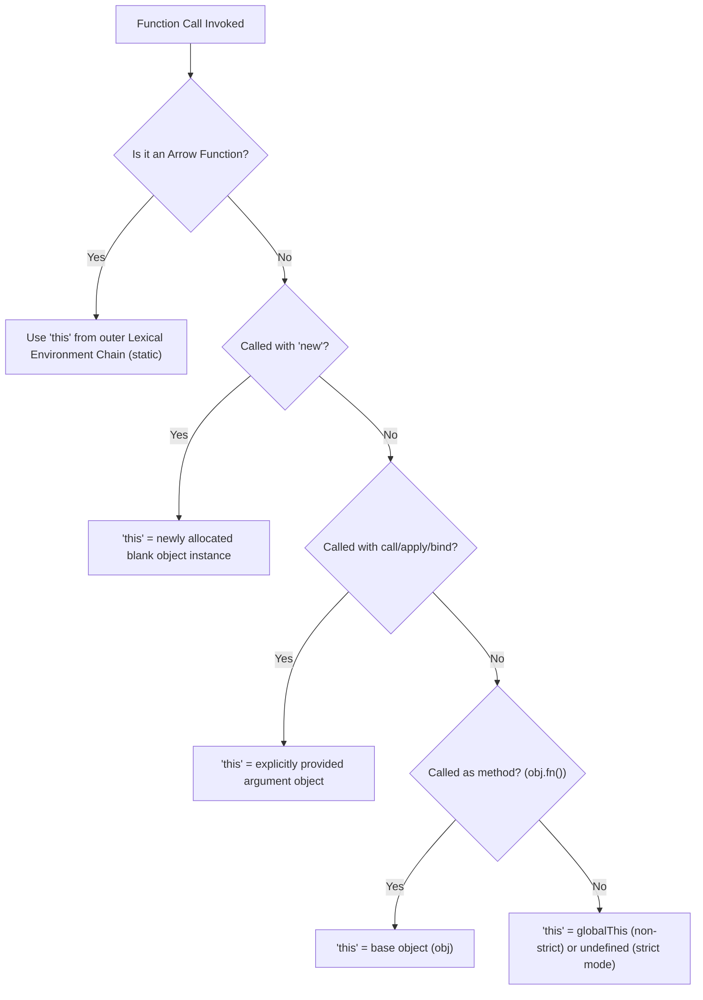

# `this` Binding

## 1. 💡 Intuition & ELI5 Analogy

Think of `this` as the pronoun "me" in spoken language. If a person stands on stage and says, *"Pass me the microphone,"* the word *"me"* refers to whoever is holding the stage at that exact instant. If someone else takes the stage and says the exact same sentence, *"me"* now refers to the new speaker. In JavaScript, regular functions do not own a fixed `this` when they are defined; `this` is evaluated dynamically based on **how** and **where** the function is invoked (the call site).

The major exception is **arrow functions**: arrow functions do not have their own `this`. They act like a direct quotation—capturing the `this` of the surrounding scope where they were written.

A classic backend bug occurs when passing an object method as a callback (e.g., to an `EventEmitter`, `setTimeout`, or express route handler), causing `this` to detach and evaluate to `undefined`:

```typescript
// ❌ Naive / Broken State: Detached method losing 'this' binding
class DatabaseLogger {
  private prefix = "[DB_LOG]";

  logMessage(msg: string): void {
    // When passed as a raw callback, 'this' becomes undefined in strict mode!
    console.log(`${this.prefix} ${msg}`); // 💥 TypeError: Cannot read properties of undefined (reading 'prefix')
  }
}

const dbLogger = new DatabaseLogger();
// Method detached from dbLogger instance:
const detachedLog = dbLogger.logMessage;
// detachedLog("Connection established"); // Crashes!
```

```typescript
// ✅ Correct State: Preserving 'this' context via Arrow Function or Explicit Binding
class SafeDatabaseLogger {
  private prefix = "[DB_LOG]";

  // Strategy 1: Bound Arrow Property (captures 'this' at instantiation)
  logMessage = (msg: string): void => {
    console.log(`${this.prefix} ${msg}`);
  };

  // Strategy 2: Explicit bind in constructor
  logMessageExplicit(msg: string): void {
    console.log(`${this.prefix} ${msg}`);
  }

  constructor() {
    this.logMessageExplicit = this.logMessageExplicit.bind(this);
  }
}

const safeLogger = new SafeDatabaseLogger();
const detachedLog1 = safeLogger.logMessage;
detachedLog1("Connection active"); // ✅ Output: [DB_LOG] Connection active
```

---

## 2. 🔬 Deep Architectural Breakdown & Engine Mechanics

In V8, when an Execution Context is created for a function invocation, the engine calculates its **`ThisBinding`** according to 4 strict precedence rules, plus the special rule for arrow functions.

### The 4 Call-Site Precedence Rules



#### 1. `new` Binding (Highest Precedence)
When a function is called with `new Fn(...)`:
- V8 allocates a new blank object in heap memory inheriting from `Fn.prototype`.
- The Execution Context's `ThisBinding` is set to that new object.
- If the constructor does not explicitly return an object, `this` is returned automatically.

#### 2. Explicit Binding (`call`, `apply`, `bind`)
- `fn.call(thisArg, arg1, arg2)` & `fn.apply(thisArg, [args])`: Immediately invoke `fn` setting `ThisBinding` = `thisArg`.
- `fn.bind(thisArg)`: Creates an exotic function object (`[[BoundTargetFunction]]`) wrapping `fn` and hard-coding `thisArg`. Subsequent calls to a bound function can never override its `this` (except with `new`).

#### 3. Implicit Binding (Method Invocation)
- When invoking `obj.method()`, V8 evaluates the property reference `obj.method`.
- In ECMAScript specifications, property access returns a **Reference Record** consisting of `(baseValue: obj, referencedName: "method", strict: true)`.
- When `()` executes the reference record, V8 extracts `baseValue` (`obj`) and assigns it as `ThisBinding`.
- **Warning**: Assigning the method to a variable (`const fn = obj.method; fn()`) discards the Reference Record base value, falling back to Default Binding!

#### 4. Default Binding (Standalone Invocation)
- Invoking `fn()` as a plain standalone function without a reference base object sets `ThisBinding` to `undefined` in strict mode (`"use strict"` / ESM / TypeScript default), or `globalThis` (`window`/`global`) in non-strict mode.

#### 5. Arrow Functions (`() => {}`)
- Arrow functions **do not possess a `ThisBinding` slot** in their Execution Context.
- When `this` is accessed inside an arrow function, V8 performs standard lexical scope resolution, looking up the scope chain (`[[OuterEnv]]`) until it finds an enclosing regular function context or the module root.

---

## 3. 💻 Complete Production Code + Line-by-Line Annotations

Below is a production-grade TypeScript module (`this-exercises.ts`) demonstrating context preservation, custom binding utility implementation, and event listener handler safety.

```typescript
/**
 * this-exercises.ts
 * Demonstrates 'this' binding rules, context preservation strategies,
 * and safe callback detachment prevention in backend service handlers.
 */

export interface EventListener {
  (data: unknown): void;
}

/**
 * Event Hub class that manages event registration and dispatching.
 */
export class TaskEventHub {
  private listeners = new Map<string, Set<EventListener>>();
  private eventCount = 0;

  /**
   * Register a listener for an event type.
   */
  public subscribe(eventType: string, listener: EventListener): void {
    let handlers = this.listeners.get(eventType);
    if (!handlers) {
      handlers = new Set();
      this.listeners.set(eventType, handlers);
    }
    handlers.add(listener);
  }

  /**
   * Emit an event, invoking all registered listeners.
   */
  public publish(eventType: string, payload: unknown): void {
    this.eventCount++;
    const handlers = this.listeners.get(eventType);
    if (handlers) {
      for (const handler of handlers) {
        // Invoking listener as standalone function
        handler(payload);
      }
    }
  }

  public getMetrics(): { totalEvents: number; activeTypes: number } {
    return {
      totalEvents: this.eventCount,
      activeTypes: this.listeners.size,
    };
  }
}

/**
 * Service processing tasks and logging metrics using class methods.
 */
export class WorkerTaskProcessor {
  public readonly processorId: string;
  private completedCount = 0;

  constructor(processorId: string) {
    this.processorId = processorId;
    
    // Explicit hard-binding inside constructor guarantees safety
    this.handleTaskCompletedExplicit = this.handleTaskCompletedExplicit.bind(this);
  }

  // 1. Regular Method: Vulnerable to 'this' detachment if passed un-bound
  public handleTaskCompletedUnsafe(payload: unknown): string {
    // If 'this' is undefined, accessing this.processorId throws TypeError
    this.completedCount++;
    const message = `[Processor ${this.processorId}] Task finished: ${JSON.stringify(payload)}`;
    console.log(message);
    return message;
  }

  // 2. Bound Method via Constructor Explicit Binding
  public handleTaskCompletedExplicit(payload: unknown): string {
    this.completedCount++;
    const message = `[Processor ${this.processorId}] Explicit handle finished: ${JSON.stringify(payload)}`;
    console.log(message);
    return message;
  }

  // 3. Arrow Function Property: Lexically bound at instantiation time
  public handleTaskCompletedArrow = (payload: unknown): string => {
    this.completedCount++;
    const message = `[Processor ${this.processorId}] Arrow handle finished: ${JSON.stringify(payload)}`;
    console.log(message);
    return message;
  };

  public getStats(): { processorId: string; completedCount: number } {
    return {
      processorId: this.processorId,
      completedCount: this.completedCount,
    };
  }
}

/**
 * Utility function to auto-bind all methods of a class instance.
 * Useful for legacy classes or third-party service objects.
 */
export function autoBindInstance<T extends object>(instance: T): T {
  const prototype = Object.getPrototypeOf(instance);
  const propertyNames = Object.getOwnPropertyNames(prototype);

  for (const name of propertyNames) {
    if (name === "constructor") continue;

    const descriptor = Object.getOwnPropertyDescriptor(prototype, name);
    if (descriptor && typeof descriptor.value === "function") {
      // Bind method to instance and assign directly to instance property
      Object.defineProperty(instance, name, {
        value: descriptor.value.bind(instance),
        writable: true,
        configurable: true,
        enumerable: false,
      });
    }
  }

  return instance;
}
```

---

## 4. ⚠️ Real-World Failure Modes & Security Edge Cases

### 1. Passing Unbound Class Methods to Express Routes / Middleware
- **Failure Mode**: Writing `app.get("/users", userService.getUsers)` in Express or Fastify. When the HTTP router executes `handler(req, res)`, `userService.getUsers` runs with `this === undefined`, crashing the process on request arrival.
- **Prevention**: Pass arrow functions (`(req, res) => userService.getUsers(req, res)`) or use `autoBindInstance(userService)`.

### 2. Attempting to Override Arrow Function `this` with `call`/`apply`/`bind`
- **Failure Mode**: Attempting `arrowFn.call(customContext)` expecting `this` to change. `call`/`apply`/`bind` silently ignore the `thisArg` parameter for arrow functions without throwing an error.
- **Prevention**: Use regular functions when dynamic context overriding (`call`/`apply`) is required.

### 3. Destructuring Object Methods
- **Failure Mode**: Destructuring methods from a service or client object:
```typescript
const { query } = dbPool;
// Destructured 'query' is now a standalone function reference
await query("SELECT 1"); // 💥 TypeError: Cannot read properties of undefined (reading 'internalConnection')
```
- **Prevention**: Call methods off their owner object (`await dbPool.query(...)`) or bind methods prior to destructuring.

---

## 5. 🛠️ Hands-On Guided Exercise & Reference Solution

### Exercise Task
Write a TypeScript class `TaskQueueRunner` that executes a list of async task functions. Implement a method `runWithTimeout(tasks: Array<() => Promise<void>>, timeoutMs: number)` that maintains accurate metrics (`executedTasks`, `failedTasks`) on the runner instance, ensuring `this` is correctly preserved regardless of how internal timer callbacks invoke runner methods.

### Reference Solution

```typescript
export interface QueueMetrics {
  executedTasks: number;
  failedTasks: number;
}

export class TaskQueueRunner {
  private executedCount = 0;
  private failedCount = 0;

  // Arrow function guarantees lexical 'this' binding for state updates
  private recordSuccess = (): void => {
    this.executedCount++;
  };

  private recordFailure = (): void => {
    this.failedCount++;
  };

  public async runTaskWithSafety(task: () => Promise<void>): Promise<boolean> {
    try {
      await task();
      this.recordSuccess();
      return true;
    } catch (err) {
      this.recordFailure();
      return false;
    }
  }

  public getMetrics = (): QueueMetrics => {
    return {
      executedTasks: this.executedCount,
      failedTasks: this.failedCount,
    };
  };
}
```
