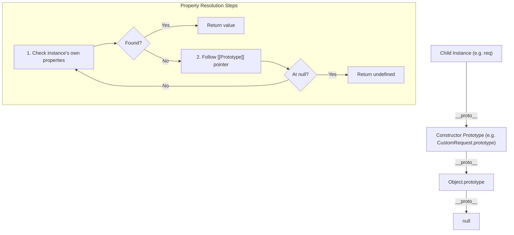

# Prototypes & Prototype Chain

## 1. 💡 Intuition & ELI5 Analogy

Think of prototypes as a company's internal **escalation policy** or standard operation manual. If a customer asks a lower-level support representative for a custom service, the representative first checks their own desk (own properties). If they don't have it, they delegate to their direct manager (the internal prototype link `[[Prototype]]` or `__proto__`). If the manager doesn't have it either, the manager delegates to the director, all the way up to the CEO (`Object.prototype`). If even the CEO doesn't have it, the response is `undefined`.

Every JavaScript object has an internal hidden link to another object called its **prototype**. Property lookups walk up this prototype chain dynamically. Crucially, property **reads** traverse up the chain, but property **writes/assignments** happen on the object itself (shadowing the prototype property), unless defined with specific setter descriptors.

A classic backend failure occurs when code mutates `Object.prototype` (Prototype Pollution) or misconfigures prototype delegation when building custom model layers, causing state leakage across requests.

```typescript
// ❌ Naive / Broken State: Prototype Pollution & Shared State Leak
interface UserSession {
  roles: string[];
}

function createSession(): UserSession {
  // Naive object inheritance sharing mutable reference
  const baseSession = { roles: ["user"] };
  const session = Object.create(baseSession);
  return session;
}

const aliceSession = createSession();
const bobSession = createSession();

// Unintentionally mutating the shared prototype property via direct push
(aliceSession as any).__proto__.roles.push("admin");

console.log(bobSession.roles); 
// 🚨 DANGER: Output is ["user", "admin"] — Bob escalated to admin privileges!
```

---

## 2. 🔬 Deep Architectural Breakdown & Engine Mechanics

Under the hood in V8, JavaScript objects do not store class definitions; they store shape descriptors (Hidden Classes / Maps) and prototype pointers.



### Key distinctions:
1. `prototype`: A property present **only on functions** (constructor functions / classes). It defines what object will become the `[[Prototype]]` link for instances created via `new`.
2. `[[Prototype]]` / `__proto__`: The internal, hidden link present on **every object**, pointing to its parent prototype. In modern code, `Object.getPrototypeOf(obj)` and `Object.setPrototypeOf(obj)` access this.
3. `Object.create(proto)`: Creates a brand-new object with its internal `[[Prototype]]` set directly to `proto`.
4. **Prototype Shadowing**: Writing `obj.prop = val` assigns `prop` directly to `obj`. It does **not** overwrite `proto.prop`. Subsequent reads on `obj.prop` will hit `obj` first, hiding (shadowing) the prototype's property.

---

## 3. 💻 Complete Production Code + Line-by-Line Annotations

Here is a clean implementation of lightweight object inheritance, property resolution inspection, and prototype-safe object instantiation for a backend execution context:

```typescript
// 1. Define a base constructor function pattern (pre-class paradigm / manual delegation)
export interface BaseHandler {
  tenantId: string;
  handle(payload: Record<string, unknown>): string;
}

export function BaseHandler(this: BaseHandler, tenantId: string) {
  // Line Annotation: Assign instance-specific state directly to the instance
  this.tenantId = tenantId;
}

// Line Annotation: Define methods on the prototype to save memory (shared across all instances)
BaseHandler.prototype.handle = function (payload: Record<string, unknown>): string {
  return `[Tenant: ${this.tenantId}] Processing payload: ${JSON.stringify(payload)}`;
};

// 2. Derive a specialized handler with prototype delegation
export interface ApiHandler extends BaseHandler {
  endpoint: string;
  execute(payload: Record<string, unknown>): string;
}

export function ApiHandler(this: ApiHandler, tenantId: string, endpoint: string) {
  // Line Annotation: Execute parent constructor with explicit 'this' binding
  BaseHandler.call(this, tenantId);
  this.endpoint = endpoint;
}

// Line Annotation: Establish the prototype chain: ApiHandler.prototype ---> BaseHandler.prototype
ApiHandler.prototype = Object.create(BaseHandler.prototype);

// Line Annotation: Restore the constructor pointer (Object.create overwrites constructor reference)
Object.defineProperty(ApiHandler.prototype, "constructor", {
  value: ApiHandler,
  enumerable: false,
  writable: true,
  configurable: true,
});

// Line Annotation: Add child-specific method to child prototype
ApiHandler.prototype.execute = function (payload: Record<string, unknown>): string {
  const baseResult = this.handle(payload); // Delegates up prototype chain to BaseHandler.prototype.handle
  return `${baseResult} -> Endpoint: ${this.endpoint}`;
};

// 3. Helper to create completely prototype-less dictionary (safe from Prototype Pollution)
export function createSafeDictionary<T>(): Record<string, T> {
  // Line Annotation: Object.create(null) creates an object with [[Prototype]] = null (no Object.prototype methods)
  return Object.create(null);
}
```

---

## 4. ⚠️ Real-World Failure Modes & Security Edge Cases

1. **Prototype Pollution Vulnerability (CVE Risk)**:
   When deep-merging unformatted JSON payloads (e.g., `lodash.merge`, custom recursive assigners), keys like `__proto__` or `constructor.prototype` can mutate `Object.prototype`. This injects properties globally across every object in the Node.js process, leading to Denial of Service (DoS) or Remote Code Execution (RCE).
   
2. **Performance Degradation via `Object.setPrototypeOf`**:
   Calling `Object.setPrototypeOf(obj, newProto)` breaks V8's Inline Caches (IC) and optimizes hidden shapes. V8 will slow down property accesses on `obj` and any related objects by orders of magnitude. Always use `Object.create()` before object initialization rather than mutating existing prototypes.

3. **`hasOwnProperty` Shadowing Bug**:
   If an incoming payload has a key called `"hasOwnProperty"`, calling `obj.hasOwnProperty("key")` will crash with `TypeError: obj.hasOwnProperty is not a function`. Always use `Object.prototype.hasOwnProperty.call(obj, key)` or `Object.hasOwn(obj, key)`.

4. **Iterating Over Inherited Enumerable Properties**:
   A `for...in` loop iterates over an object's own properties **plus** all enumerable properties up the prototype chain. Forgetting `Object.hasOwn(obj, key)` or using `Object.keys()` can process unwanted parent properties.

---

## 5. 🛠️ Hands-On Guided Exercise & Reference Solution

### Task
Implement a safe prototype-based plugin registry `PluginRegistry` that:
1. Stores default configuration on a prototype object.
2. Allows instances to shadow defaults without mutating the shared defaults.
3. Provides a method `isPolluted()` to verify that `Object.prototype` hasn't been tampered with.

### Reference Solution

```typescript
export class PluginRegistry {
  private config: Record<string, unknown>;

  constructor(defaultConfig: Record<string, unknown>) {
    // Create a dictionary delegating to defaultConfig without mutating it
    this.config = Object.create(defaultConfig);
  }

  // Set an instance-specific override (shadowing)
  public set(key: string, value: unknown): void {
    // Check against prototype pollution keys
    if (key === "__proto__" || key === "constructor" || key === "prototype") {
      throw new Error(`Security Violation: Refusing to modify prototype key "${key}"`);
    }
    this.config[key] = value;
  }

  // Get configuration key (traverses up prototype chain)
  public get(key: string): unknown {
    return this.config[key];
  }

  // Verify if a property is directly on the instance vs inherited
  public isOverridden(key: string): boolean {
    return Object.hasOwn(this.config, key);
  }

  // Static check for Object.prototype tampering
  public static isPolluted(testKey: string): boolean {
    return Object.prototype.hasOwnProperty(testKey);
  }
}
```
