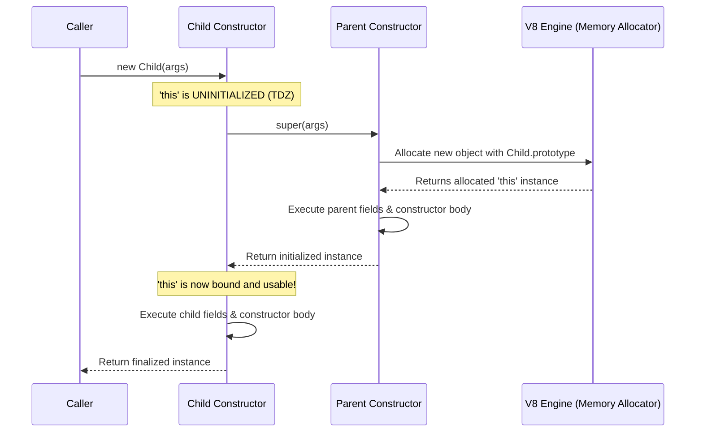

# Classes in JavaScript & TypeScript

## 1. 💡 Intuition & ELI5 Analogy

Think of a **Class** as a formal architectural blueprint and factory specification. In early JavaScript, creating reusable object blueprints meant manually gluing constructor functions to prototype objects. This was like assembling a car using custom hand-drawn blueprints where anyone could slip in extra gears or bypass safety locks. The `class` syntax introduced in ES6 standardizes these blueprints with clean syntax, strict enforcement rules (like requiring the `new` operator), and engine-level features like private fields (`#field`) that provide true encapsulated boundaries.

Before `class` syntax, engineers manually linked prototypes and emulated inheritance using constructor functions, often resulting in fragile boilerplate, missing `new` checks, and manual prototype inheritance steps:

```javascript
// NAIVE / BEFORE: Emulating classes with constructor functions and prototype chaining
function BaseLogger(prefix) {
  // Bug 1: Forgetting 'new' mutates global object or throws in strict mode
  if (!(this instanceof BaseLogger)) {
    return new BaseLogger(prefix);
  }
  this.prefix = prefix;
}

BaseLogger.prototype.log = function (msg) {
  console.log(`[${this.prefix}] ${msg}`);
};

function FileLogger(prefix, filePath) {
  // Bug 2: Manual parent constructor call
  BaseLogger.call(this, prefix);
  this.filePath = filePath;
}

// Bug 3: Verbose and error-prone prototype inheritance wire-up
FileLogger.prototype = Object.create(BaseLogger.prototype);
// Bug 4: Must manually fix constructor reference back to FileLogger!
FileLogger.prototype.constructor = FileLogger;

FileLogger.prototype.log = function (msg) {
  // Bug 5: Verbose ancestor method invocation
  BaseLogger.prototype.log.call(this, `FILE(${this.filePath}): ${msg}`);
};
```

---

## 2. 🔬 Deep Architectural Breakdown & Engine Mechanics

Under the V8 engine hood, a `class` is not a primitive type—it is a special function with an internal `[[IsClassConstructor]]: true` slot. Understanding how V8 processes classes demystifies its behavior, performance characteristics, and temporal traps.

### Class Mechanics vs. Standard Functions

1. **`new` Enforcement**: Attempting to invoke a class without `new` causes V8 to check `[[IsClassConstructor]]` and throw a `TypeError: Class constructor Foo cannot be invoked without 'new'`. Standard functions do not have this restriction.
2. **Strict Mode**: The entire body of a class implicitly executes in `strict mode`.
3. **Non-Enumerable Prototype Methods**: Methods defined within a class body are added to `Class.prototype` with property descriptor `{ enumerable: false, writable: true, configurable: true }`. Traditional prototype assignments like `Foo.prototype.bar = ...` default to `enumerable: true`.

### Subclass Construction & The `this` Initialization Trap

In derived classes (`class Child extends Parent`), object allocation and `this` binding work differently from base classes:



In a base class, calling `new Base()` immediately allocates an empty object linked to `Base.prototype` and binds it to `this` before entering the constructor body.

In a **derived class** (`class Derived extends Base`), `this` starts in an **uninitialized state** (Temporal Dead Zone for `this`).
- Accessing `this` before calling `super()` throws a `ReferenceError: Must call super constructor in derived class before accessing 'this'`.
- `super(...)` delegates object allocation up the prototype chain to the root base class constructor. The base class allocates the object instance (setting its internal `[[Prototype]]` to `Derived.prototype`), binds fields, and returns `this` down the execution stack.
- Instance field initializers defined on `Derived` execute **immediately after** `super()` returns, right before the body of `Derived`'s constructor executes.

### Engine-Level Private Fields (`#private`)

Unlike TypeScript's compile-time `private` modifier (which is stripped during transpilation), JavaScript's `#field` syntax creates runtime private elements enforced directly by the JS engine:

- **Private Symbol / Internal Slots**: V8 stores `#field` values in a private key storage map attached to the object instance (not on `prototype`).
- **Strict Brand Checking**: Evaluating `obj.#field` invokes an internal brand check. If `obj` was not instantiated by the class declaring `#field`, V8 immediately throws `TypeError: Cannot read private member #field from an object whose class did not declare it`.
- **In-Operator Brand Checks**: The expression `#field in obj` performs a runtime brand check returning `true` or `false` without throwing.

---

## 3. 💻 Complete Production Code + Line-by-Line Annotations

Here is a complete, production-grade event pipeline batch processor demonstrating static initializers, private fields, brand checks, getters/setters, subclassing with `super`, and field declaration execution order.

```typescript
/**
 * Production Example: Robust Event Batch Processor using Modern ES/TS Classes
 */

export interface EventPayload {
  id: string;
  type: string;
  timestamp: number;
  data: Record<string, unknown>;
}

export abstract class BaseProcessor {
  // Private static counter tracked across processor instances
  static #totalProcessedCount: number = 0;

  // Static initialization block for complex setup
  static {
    // Executes once when the class definition is evaluated by the JS runtime
    this.#totalProcessedCount = 0;
  }

  // Instance field initializer (runs after super() in derived classes)
  readonly createdAt: Date = new Date();

  // Engine-enforced private instance field
  #isShutdown: boolean = false;

  constructor(public readonly processorId: string) {
    if (!processorId) {
      throw new Error("Processor ID must be non-empty.");
    }
  }

  // Getter for static metric
  static get totalProcessed(): number {
    return BaseProcessor.#totalProcessedCount;
  }

  // Protected static helper to increment shared metric
  protected static incrementGlobalCount(amount: number): void {
    BaseProcessor.#totalProcessedCount += amount;
  }

  // Getter for private shutdown state
  get isShutdown(): boolean {
    return this.#isShutdown;
  }

  // Brand check method to inspect arbitrary objects
  static isBaseProcessor(obj: unknown): boolean {
    if (typeof obj !== "object" || obj === null) return false;
    // Performs engine brand checking safely
    return #isShutdown in obj;
  }

  // Instance method performing graceful shutdown
  shutdown(): void {
    if (this.#isShutdown) {
      throw new Error(`Processor [${this.processorId}] is already shut down.`);
    }
    this.#isShutdown = true;
  }

  // Abstract processing method to be implemented by subclasses
  abstract processBatch(events: EventPayload[]): Promise<number>;
}

export class TelemetryEventProcessor extends BaseProcessor {
  // Private instance state for buffer management
  #maxBatchSize: number;
  #processedEventIds: Set<string> = new Set();

  constructor(processorId: string, maxBatchSize: number = 100) {
    // 1. MUST call super() before accessing 'this' or instance properties
    super(processorId);

    // 2. Validate parameters after super() returns
    if (maxBatchSize <= 0) {
      throw new Error("Max batch size must be greater than 0.");
    }

    // 3. Initialize subclass instance fields
    this.#maxBatchSize = maxBatchSize;
  }

  // Getter / Setter for batch size configuration
  get maxBatchSize(): number {
    return this.#maxBatchSize;
  }

  set maxBatchSize(newSize: number) {
    if (newSize <= 0) {
      throw new Error("Batch size must be positive.");
    }
    this.#maxBatchSize = newSize;
  }

  // Implementation of abstract method
  async processBatch(events: EventPayload[]): Promise<number> {
    // Check state using inherited getter
    if (this.isShutdown) {
      throw new Error(`Cannot process batch: Processor [${this.processorId}] is shut down.`);
    }

    if (events.length > this.#maxBatchSize) {
      throw new Error(`Batch size ${events.length} exceeds limit of ${this.#maxBatchSize}`);
    }

    let newlyProcessedCount = 0;

    for (const event of events) {
      if (this.#processedEventIds.has(event.id)) {
        continue; // Skip duplicates
      }
      this.#processedEventIds.add(event.id);
      newlyProcessedCount++;
    }

    // Increment global static counter via inherited static method
    BaseProcessor.incrementGlobalCount(newlyProcessedCount);

    return newlyProcessedCount;
  }
}
```

---

## 4. ⚠️ Real-World Failure Modes & Security Edge Cases

### Failure Mode 1: Accessing `this` before `super()` in Derived Constructors

```typescript
class CustomError extends Error {
  code: string;

  constructor(message: string, code: string) {
    // BUG: Accessing 'this' before calling super()
    this.code = code; // ReferenceError: Must call super constructor in derived class before accessing 'this'
    super(message);
  }
}
```
**Prevention**: Always place `super(...)` as the very first statement in derived constructors before accessing or setting properties on `this`.

### Failure Mode 2: Loss of Method Context when Passing Class Methods as Callbacks

```typescript
class DatabaseService {
  tableName = "users";

  query() {
    return `SELECT * FROM ${this.tableName}`;
  }
}

const db = new DatabaseService();
const fetcher = db.query; // Detaching method from instance!

// BUG: 'this' is undefined inside query() when invoked in strict mode
console.log(fetcher()); // TypeError: Cannot read properties of undefined (reading 'tableName')
```
**Prevention**: Either bind the method in constructor (`this.query = this.query.bind(this)`), use arrow functions for instance callbacks, or invoke via closure `() => db.query()`.

### Failure Mode 3: Confusing TypeScript `private` with ES Private Fields `#`

```typescript
class AccountService {
  private secretKey = "super-secret"; // TypeScript compile-time visibility ONLY
  #runtimeSecret = "engine-enforced-secret"; // JS Runtime private field
}

const account = new AccountService() as any;
console.log(account.secretKey); // "super-secret" (Bypassed type checker at runtime!)
console.log(account.#runtimeSecret); // SyntaxError / TypeError (Engine blocks runtime access!)
```
**Prevention**: Use `#field` whenever actual runtime isolation or security boundaries (e.g. key management, private tokens) are required.

---

## 5. 🛠️ Hands-On Guided Exercise & Reference Solution

### Exercise Task

Build a `RateLimiter` class and a derived `TokenBucketRateLimiter` class that satisfies the following requirements:

1. `RateLimiter` (Base Class):
   - Private field `#capacity` (number).
   - Constructor accepting `capacity` (must be > 0).
   - Public getter `capacity`.
   - Abstract method `tryConsume(tokens: number): boolean`.
2. `TokenBucketRateLimiter` (Subclass):
   - Private fields `#tokens` (current available tokens) and `#fillRatePerSec` (number).
   - Constructor accepting `capacity` and `fillRatePerSec`.
   - Implement `tryConsume(tokens)`: consumes tokens if available and returns `true`, otherwise returns `false`.
   - Method `refill(elapsedSeconds: number)`: adds `elapsedSeconds * fillRatePerSec` to `#tokens`, capped at `#capacity`.

### Reference Solution

```typescript
abstract class RateLimiter {
  #capacity: number;

  constructor(capacity: number) {
    if (capacity <= 0) {
      throw new Error("Capacity must be strictly positive.");
    }
    this.#capacity = capacity;
  }

  get capacity(): number {
    return this.#capacity;
  }

  abstract tryConsume(tokens: number): boolean;
}

class TokenBucketRateLimiter extends RateLimiter {
  #tokens: number;
  #fillRatePerSec: number;

  constructor(capacity: number, fillRatePerSec: number) {
    super(capacity); // Must be first!

    if (fillRatePerSec <= 0) {
      throw new Error("Fill rate must be positive.");
    }

    this.#fillRatePerSec = fillRatePerSec;
    this.#tokens = capacity; // Start at full capacity
  }

  get tokens(): number {
    return this.#tokens;
  }

  refill(elapsedSeconds: number): void {
    if (elapsedSeconds < 0) return;
    const added = elapsedSeconds * this.#fillRatePerSec;
    this.#tokens = Math.min(this.capacity, this.#tokens + added);
  }

  tryConsume(tokens: number): boolean {
    if (tokens <= 0) {
      throw new Error("Tokens requested must be positive.");
    }
    if (this.#tokens >= tokens) {
      this.#tokens -= tokens;
      return true;
    }
    return false;
  }
}

// Verification usage
const limiter = new TokenBucketRateLimiter(10, 2); // capacity 10, 2 tokens/sec
console.log(limiter.tryConsume(8)); // true (2 tokens left)
console.log(limiter.tryConsume(5)); // false (not enough tokens)
limiter.refill(2); // refills 4 tokens -> 6 total
console.log(limiter.tryConsume(5)); // true (1 token left)
```
