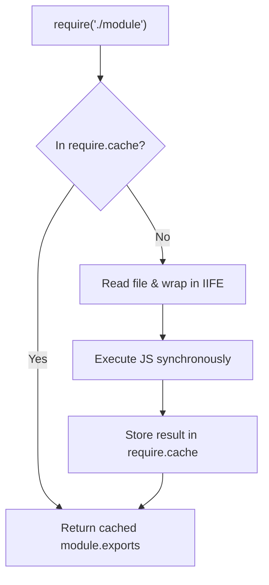

# Modules: ESM vs CommonJS

## 1. 💡 Intuition & ELI5 Analogy

Think of **CommonJS (CJS)** like a restaurant kitchen where dishes are cooked synchronously on demand when an order arrives (`require()`). Think of **ECMAScript Modules (ESM)** like a high-speed assembly line with pre-flight blueprints: before any machine runs, all module imports, exports, and relationships are statically inspected, mapped, and linked before executing top-level code.

In Node.js backend development, misunderstanding the differences between CJS and ESM leads to runtime crashes (`ERR_REQUIRE_ESM`), broken bundlers, scope variable leakage, and dual package hazards in production microservices.

```javascript
// NAIVE / BROKEN (CommonJS attempting to synchronously load pure ESM package)
// index.cjs
const fetch = require('node-fetch'); // Throws ERR_REQUIRE_ESM in modern Node!
```

---

## 2. 🔬 Deep Architectural Breakdown & Engine Mechanics

### CommonJS (CJS) Execution Model

CommonJS is Node's original module system designed for synchronous server-side I/O.

1. **Dynamic Execution**: `require(path)` is a normal JavaScript function executed at runtime. Paths can be dynamically constructed via strings (`require('./routes/' + routeName)`).
2. **Module Wrapper Function**: Node wraps every `.js` / `.cjs` file in an IIFE before evaluation:
   ```javascript
   (function (exports, require, module, __filename, __dirname) {
     // Your CJS module code resides here
   });
   ```
3. **Copy-by-Value & Caching**: When `module.exports` is populated, consumer modules receive a snapshot/copy of the exported values. Evaluated module instances are stored in `require.cache`.



---

### ECMAScript Modules (ESM) Execution Model

ESM is the official ECMAScript standard specification for modular JS.

1. **Static 3-Phase Loading**:
   * **Phase 1: Construction (Parsing)**: Fetches files, parses source code into AST, and builds the static Module Graph without running JS code.
   * **Phase 2: Instantiation (Linking)**: Allocates memory slots for exported values and connects imports/exports via **Live Bindings** (pointers to memory slots).
   * **Phase 3: Evaluation**: Executes code top-to-bottom and fills memory slots. Supports Top-Level `await`.
2. **Lexical Scope & No Wrapper**: ESM modules operate in strict mode by default. Legacy globals like `__dirname`, `__filename`, and `require` do not exist.
3. **Static Analysis**: `import` and `export` statements must reside at top-level scope (unless dynamic `import()` is explicitly called).

---

## 3. 💻 Complete Production Code + Line-by-Line Annotations

### Dual-Module Interoperability & Path Resolution Pattern

Below is a production-grade utility demonstrating how to cleanly bridge CommonJS modules into an ESM-first Node.js application:

```javascript
// service-bootstrap.mjs
import { createRequire } from 'node:module';
import { fileURLToPath } from 'node:url';
import { dirname, join } from 'node:path';

// 1. Re-creating legacy CJS scope variables natively in ESM
const __filename = fileURLToPath(import.meta.url);
const __dirname = dirname(__filename);

// 2. Instantiating a CJS loader context within ESM
const require = createRequire(import.meta.url);

// 3. Loading legacy CommonJS configuration file synchronously
const legacyConfig = require('./config/database.cjs');

/**
 * Dynamically loads an ESM module conditionally at runtime
 * @param {string} featureName 
 */
async function loadFeatureModule(featureName) {
  if (featureName === 'analytics') {
    // Dynamic import returns a Promise resolving to the Module Namespace Object
    const analyticsModule = await import('./features/analytics.mjs');
    analyticsModule.initAnalytics({
      dbUrl: legacyConfig.connectionString
    });
  }
}

console.log(`[ESM Environment] Base Directory: ${__dirname}`);
console.log(`[CJS Integration] Loaded DB Config: ${legacyConfig.dbName}`);

await loadFeatureModule('analytics');
```

---

## 4. ⚠️ Real-World Failure Modes & Security Edge Cases

1. **The Dual Package Hazard**:
   If a library provides both ESM (`pkg.mjs`) and CJS (`pkg.cjs`) builds, and an application imports both versions across different internal files, Node loads and evaluates the library *twice*. This duplicates global state, singletons, and cache instances, causing subtle state mismatch bugs.

2. **Live Binding Mutation vs Copy Differences**:
   * In **CJS**, reassigning an exported variable inside the defining module does *not* update consumer imports because `module.exports` exported a copy/snapshot at evaluation time.
   * In **ESM**, imports are **Live Bindings** (direct pointers to memory slots). If the exporting module mutates its internal value, all consumer modules immediately read the updated value.

```javascript
// ESM Live Binding Example
// counter.mjs
export let count = 0;
export function increment() { count++; }

// app.mjs
import { count, increment } from './counter.mjs';
console.log(count); // 0
increment();
console.log(count); // 1 (Reflects live memory pointer mutation!)
```

3. **Circular Dependency Handling**:
   * **CJS**: Returns an incomplete, partially evaluated `exports` object when a cycle is encountered.
   * **ESM**: Uninitialized live bindings accessed during circular imports before evaluation throw `ReferenceError: Cannot access 'X' before initialization` due to TDZ (Temporal Dead Zone) rules.

---

## 5. 🛠️ Hands-On Guided Exercise & Reference Solution

### Task
Create a dual-module project structure in a sandbox directory containing:
1. `legacy-config.cjs` using `module.exports`.
2. `app.mjs` using native ESM imports, `import.meta.url` for path resolution, and `createRequire` to safely consume `legacy-config.cjs`.

### Reference Solution

```javascript
// legacy-config.cjs
module.exports = {
  dbHost: 'localhost',
  dbPort: 5432,
  appName: 'BackendEngineService'
};
```

```javascript
// app.mjs
import { createRequire } from 'node:module';
import { fileURLToPath } from 'node:url';
import { dirname, join } from 'node:path';

const require = createRequire(import.meta.url);
const config = require('./legacy-config.cjs');

const __filename = fileURLToPath(import.meta.url);
const __dirname = dirname(__filename);

console.log(`[App] Initialized ${config.appName} at ${join(__dirname, 'app.mjs')}`);
console.log(`[App] Connecting to DB: ${config.dbHost}:${config.dbPort}`);
```
