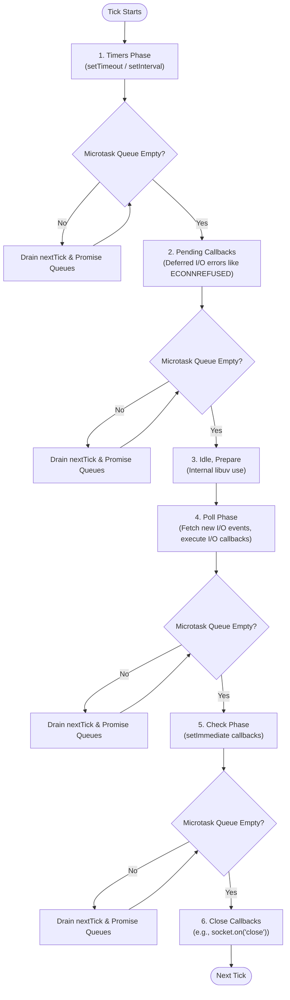

# Event Loop Phases

## 1. 💡 Intuition & ELI5 Analogy

Imagine a doctor running a clinic with five dedicated diagnostic stations arranged in a strict circular loop: **Timers Station**, **Pending Callbacks Station**, **Poll (I/O) Station**, **Check Station**, and **Close Callbacks Station**. The doctor moves in one direction from station to station, servicing patients waiting in line at each stop.

However, the doctor carries a VIP pager in their pocket. Before taking even a single step between any two stations—or after handling any individual patient—the doctor **must** check the VIP pager. If there are VIP requests waiting (`process.nextTick` and Promises), the doctor stops everything and handles **every single VIP request** until the pager queue is completely empty before moving to the next station in the circle.

```typescript
// ❌ Naive / Broken Code: Event Loop Starvation
import fs from 'node:fs';

// Imagine a server servicing HTTP requests while running a background task:
function recursiveNextTick() {
  process.nextTick(recursiveNextTick); // Continuously queues VIP microtasks
}

// Start background task
recursiveNextTick();

// Try to handle I/O (e.g. reading a configuration or incoming request)
fs.readFile(__filename, () => {
  console.log('This will NEVER print! The event loop is completely starved.');
});
```

In the naive code above, `process.nextTick` perpetually fills the VIP queue. The doctor never leaves the VIP queue to walk to the Poll (I/O) station, so file reads, network requests, and timers freeze forever.

---

## 2. 🔬 Deep Architectural Breakdown & Engine Mechanics

Node.js executes single-threaded JavaScript code on top of **V8** (the JS engine) and **libuv** (the C library that handles asynchronous I/O and the event loop).

### The 6 Phases of the libuv Event Loop

Each iteration of the event loop is called a **tick**. A tick moves through phases in a strict, sequential order:



1. **Timers Phase**: Executes callbacks scheduled by `setTimeout()` and `setInterval()` whose threshold duration has elapsed. Note: Timers specify the *minimum* delay before execution, not a guaranteed exact execution timestamp.
2. **Pending Callbacks Phase**: Executes I/O callbacks deferred from a previous loop iteration (e.g., system-level error callbacks such as TCP `ECONNREFUSED` reported by the OS).
3. **Idle, Prepare Phase**: Internal engine operations used by libuv for housekeeping prior to polling.
4. **Poll Phase**: 
   - Calculates how long to block and poll for I/O.
   - Processes events in the poll queue (file operations, network sockets, incoming HTTP connections).
   - If the queue is empty:
     - If `setImmediate()` scripts are scheduled, Node ends the poll phase and proceeds to the Check phase.
     - If no `setImmediate()` scripts are scheduled, Node waits for I/O events to be added to the queue, up to a timeout threshold based on pending timers.
5. **Check Phase**: Executes callbacks invoked via `setImmediate()`. This allows scripts to execute callbacks immediately after the Poll phase completes I/O operations.
6. **Close Callbacks Phase**: Executes close handle events, such as `socket.on('close', ...)`.

### Microtasks: `process.nextTick` vs. Promise Queue

Microtasks are **not** a libuv phase; they are maintained directly by Node.js and V8 in JavaScript runtime queues.

- **`process.nextTick` Queue**: Holds callbacks queued via `process.nextTick()`.
- **Promise Microtask Queue**: Holds resolved/rejected `.then()`, `.catch()`, `.finally()`, and `await` continuation callbacks, plus `queueMicrotask()`.

**Drain Priority**: Whenever JavaScript execution transitions between operations (or between event loop phases), Node drains microtasks completely:
1. All tasks in `process.nextTick` queue are executed first.
2. All tasks in Promise Microtask queue are executed second.
3. If executing a Promise microtask schedules another `process.nextTick`, Node clears `nextTick` again before continuing Promise microtasks.

---

## 3. 💻 Complete Production Code + Line-by-Line Annotations

Save this code to `event-loop-trace.ts` to inspect phase execution order in detail:

```typescript
import fs from 'node:fs';

console.log('1: [Sync] Main module start');

// 1. Scheduled Timer (Macrotask)
setTimeout(() => {
  console.log('2: [Timers Phase] setTimeout 0ms');
  
  process.nextTick(() => {
    console.log('3: [Microtask] process.nextTick inside setTimeout');
  });
}, 0);

// 2. Scheduled Check Phase Task (Macrotask)
setImmediate(() => {
  console.log('4: [Check Phase] setImmediate');
});

// 3. Process nextTick (Microtask - Highest Priority)
process.nextTick(() => {
  console.log('5: [Microtask] process.nextTick 1');
});

// 4. Promise Microtask
Promise.resolve().then(() => {
  console.log('6: [Microtask] Promise.then 1');
});

// 5. Native Microtask API
queueMicrotask(() => {
  console.log('7: [Microtask] queueMicrotask 1');
});

// 6. I/O Polling Operation
fs.readFile(__filename, () => {
  console.log('8: [Poll Phase] fs.readFile callback');

  // INSIDE I/O CALLBACK: Check phase guarantees setImmediate fires before setTimeout!
  setTimeout(() => {
    console.log('9: [Timers Phase] setTimeout inside I/O');
  }, 0);

  setImmediate(() => {
    console.log('10: [Check Phase] setImmediate inside I/O');
  });

  process.nextTick(() => {
    console.log('11: [Microtask] process.nextTick inside I/O');
  });
});

console.log('12: [Sync] Main module end');
```

### Execution Trace & Order Rationale

1. `1: [Sync] Main module start` — Executes synchronously during initial script evaluation.
2. `12: [Sync] Main module end` — Executes synchronously before initial call stack clears.
3. **Microtask Drainage (Main Module)**:
   - `5: [Microtask] process.nextTick 1` — `nextTick` queue drains first.
   - `6: [Microtask] Promise.then 1` — Promise queue drains second.
   - `7: [Microtask] queueMicrotask 1` — `queueMicrotask` shares the Promise microtask queue.
4. **Event Loop Ticks**:
   - `2: [Timers Phase] setTimeout 0ms` — Timers phase runs. (Note: In the main module, order between `setTimeout(0)` and `setImmediate` can vary slightly due to process startup timing).
   - `3: [Microtask] process.nextTick inside setTimeout` — Microtask queue drains immediately after timer callback completes.
   - `4: [Check Phase] setImmediate` — Check phase runs.
   - `8: [Poll Phase] fs.readFile callback` — File I/O completes during Poll phase.
5. **Microtask Drainage inside I/O Callback**:
   - `11: [Microtask] process.nextTick inside I/O` — Microtask drains before moving to next phase.
6. **Next Loop Phases following I/O Callback**:
   - `10: [Check Phase] setImmediate inside I/O` — **Guaranteed** to run before timer because the loop is currently in the Poll phase and proceeds immediately to the Check phase.
   - `9: [Timers Phase] setTimeout inside I/O` — Runs on the next tick's Timers phase.

---

## 4. ⚠️ Real-World Failure Modes & Security Edge Cases

### 1. Non-Deterministic `setTimeout(fn, 0)` vs `setImmediate()` in Main Scope
In the main module scope, `setTimeout(fn, 0)` and `setImmediate()` order is non-deterministic. Node converts `0ms` to `1ms` internally. If process preparation takes less than 1ms, the Timers phase won't find an expired timer and skips to Check (`setImmediate` runs first). If it takes >1ms, Timer runs first.
- **Fix**: Inside I/O callbacks, `setImmediate` is guaranteed to run first. Do not rely on `setTimeout(fn, 0)` order at script top level.

### 2. Event Loop Starvation via Recursive `process.nextTick`
If code recursively calls `process.nextTick()`, Node remains stuck draining the microtask queue indefinitely. No I/O events, network requests, or timers can ever fire.
- **Fix**: Use `setImmediate()` when yielding execution for background tasks to allow I/O and timers to run between iterations.

### 3. Microtask Infinite Recursion via Unhandled Promise Chains
Writing an un-throttled async loop like `async function loop() { await doSyncWork(); loop(); }` continues appending to the microtask queue, preventing the event loop from advancing to the Poll phase.

### 4. Blocking the Poll Phase with Heavy CPU Calculations
Synchronous operations like `JSON.parse()` on huge payloads, sync crypto operations (`crypto.pbkdf2Sync`), or intensive array iterations hold the event loop single thread in the current phase. All incoming HTTP requests stall.

---

## 5. 🛠️ Hands-On Guided Exercise & Reference Solution

### The Challenge

Write a lightweight utility function `measureEventLoopLag(intervalMs: number): () => void` that tracks event loop lag (delay in milliseconds beyond scheduled timer time) and logs a warning if lag exceeds 50ms. Return a cleanup function to stop monitoring.

### Requirements
1. Use `setInterval` or `setTimeout` combined with `performance.now()` or `process.hrtime.bigint()`.
2. Must accurately report how much the event loop was delayed due to synchronous work or microtask queue overload.

### Reference Solution

```typescript
import { performance } from 'node:perf_hooks';

/**
 * Measures Event Loop Lag by calculating the delta between target delay and actual execution time.
 */
export function measureEventLoopLag(intervalMs: number = 1000): () => void {
  let expectedTime = performance.now() + intervalMs;

  const timer = setInterval(() => {
    const now = performance.now();
    const lag = now - expectedTime;

    if (lag > 50) {
      console.warn(`⚠️ Event Loop Lag Detected: ${lag.toFixed(2)}ms (Threshold: 50ms)`);
    } else {
      console.log(`ℹ️ Event Loop Lag: ${lag.toFixed(2)}ms`);
    }

    expectedTime = now + intervalMs;
  }, intervalMs);

  // Allow process to exit cleanly if this timer is the only active handle
  timer.unref();

  // Cleanup handle
  return () => {
    clearInterval(timer);
  };
}

// Quick Test Demonstration:
const stopMonitoring = measureEventLoopLag(100);

// Simulate CPU-blocking operation after 200ms
setTimeout(() => {
  console.log('🔥 Simulating heavy synchronous work...');
  const start = Date.now();
  while (Date.now() - start < 300) {
    // Block thread for 300ms
  }
}, 200);

// Stop after 1 second
setTimeout(() => {
  stopMonitoring();
  console.log('Cleaned up event loop monitor.');
}, 1000);
```
