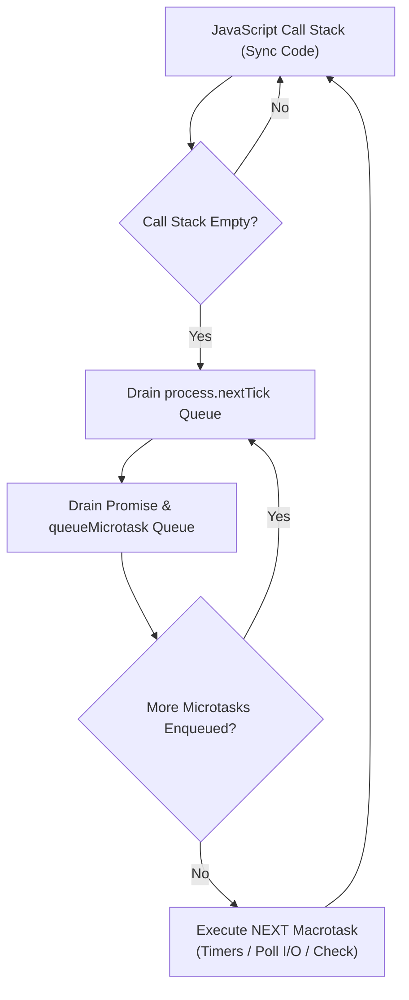

# Microtasks vs. Macrotasks

## 1. 💡 Intuition & ELI5 Analogy

Imagine working at an office desk. **Macrotasks** (Timers, I/O callbacks, `setImmediate`) are scheduled calendar appointments. When a calendar appointment triggers, you pull up the file and start working on it.

**Microtasks** (`process.nextTick`, `Promise.then`, `queueMicrotask`), on the other hand, are urgent sticky notes placed directly on your keyboard. 

Rule of the office: Before you are allowed to move to your next scheduled calendar appointment (or even look at your calendar), **you MUST process and clear every single sticky note on your keyboard**. If processing one sticky note causes someone to paste another sticky note, you must process that one too until the keyboard is completely clear.

```typescript
// ❌ Naive / Broken Code: Assuming Promise callbacks execute after Timers
console.log('Start');

setTimeout(() => {
  console.log('Timer 1');
}, 0);

Promise.resolve().then(() => {
  console.log('Promise 1');
});

console.log('End');

// Naive output expected by beginners: Start -> End -> Timer 1 -> Promise 1
// Actual output:                      Start -> End -> Promise 1 -> Timer 1
```

In the naive code above, developers often assume `setTimeout(..., 0)` runs first because it was registered earlier in the file. However, `Promise.resolve().then` registers a microtask, which drains completely before the event loop advances to the Timers macrotask phase.

---

## 2. 🔬 Deep Architectural Breakdown & Engine Mechanics

The Node.js runtime separates async tasks into two distinct queues: **Macrotask Queues** (managed by libuv event loop phases) and **Microtask Queues** (managed by V8 and Node's core environment).



### 1. Macrotasks (Task Queue)
A macrotask represents a discrete, self-contained unit of work scheduled for a future phase of the libuv event loop.

- **Sources**: `setTimeout()`, `setInterval()`, `setImmediate()`, I/O operations (`fs.readFile`, network sockets), close handlers.
- **Scheduling**: Macrotasks are distributed across specific libuv phase queues (Timers, Poll, Check).
- **Execution Rule**: The event loop picks **one** macrotask (or a batch allocated for that phase), executes its JavaScript callback, empties the call stack, and immediately checks the Microtask Queue.

### 2. Microtasks (Job Queue)
Microtasks are high-priority operations that must execute immediately after the current script or task finishes, before yielding back to the libuv event loop.

- **Sources**: `process.nextTick()`, `Promise.prototype.then/catch/finally`, `async/await` execution continuation, `queueMicrotask()`.
- **Drain Checkpoints**: V8 triggers a microtask checkpoint when:
  1. The JavaScript call stack transitions from non-empty to empty.
  2. Just before the event loop advances to the next phase in libuv.
- **Execution Rule**: Microtasks are processed to **total completion**. Node will not move to the next macrotask or event loop phase until the microtask queues are completely empty.

### The Microtask Priority Ladder

Within Node.js, microtasks have explicit internal prioritization:

| Queue | API | Priority |
| :--- | :--- | :--- |
| **`nextTick` Queue** | `process.nextTick()` | 🥇 **Highest** (Drains first) |
| **Promise Queue** | `Promise.then()`, `async/await`, `queueMicrotask()` | 🥈 **Second** (Drains after `nextTick`) |

If a Promise microtask schedules a `process.nextTick`, Node immediately pauses the Promise queue to drain the new `process.nextTick` item before resuming remaining Promises!

---

## 3. 💻 Complete Production Code + Line-by-Line Annotations

Save this complete execution trace script to `microtask-ordering.ts`:

```typescript
console.log('1: [Sync] Stack starts');

// Macrotask 1: Timers phase
setTimeout(() => {
  console.log('2: [Macrotask - Timers] setTimeout 1');
  
  process.nextTick(() => {
    console.log('3: [Microtask - nextTick] inside setTimeout 1');
  });

  Promise.resolve().then(() => {
    console.log('4: [Microtask - Promise] inside setTimeout 1');
  });
}, 0);

// Macrotask 2: Check phase
setImmediate(() => {
  console.log('5: [Macrotask - Check] setImmediate 1');
});

// Microtask: Promise Queue
Promise.resolve().then(() => {
  console.log('6: [Microtask - Promise] Promise 1');

  // Enqueue a nextTick inside a Promise callback
  process.nextTick(() => {
    console.log('7: [Microtask - nextTick] nested inside Promise 1');
  });
}).then(() => {
  console.log('8: [Microtask - Promise] Promise 2 (chained)');
});

// Microtask: queueMicrotask API
queueMicrotask(() => {
  console.log('9: [Microtask - Promise] queueMicrotask 1');
});

// Microtask: process.nextTick Queue (Priority Over Promise)
process.nextTick(() => {
  console.log('10: [Microtask - nextTick] process.nextTick 1');

  Promise.resolve().then(() => {
    console.log('11: [Microtask - Promise] inside process.nextTick 1');
  });
});

console.log('12: [Sync] Stack ends');
```

### Execution Trace & Order Rationale

```text
1: [Sync] Stack starts
12: [Sync] Stack ends
10: [Microtask - nextTick] process.nextTick 1
6: [Microtask - Promise] Promise 1
9: [Microtask - Promise] queueMicrotask 1
7: [Microtask - nextTick] nested inside Promise 1
11: [Microtask - Promise] inside process.nextTick 1
8: [Microtask - Promise] Promise 2 (chained)
2: [Macrotask - Timers] setTimeout 1
3: [Microtask - nextTick] inside setTimeout 1
4: [Microtask - Promise] inside setTimeout 1
5: [Macrotask - Check] setImmediate 1
```

### Detailed Step-by-Step Breakdown

1. `1: [Sync]` & `12: [Sync]` run synchronously on the V8 call stack.
2. Call stack becomes empty -> **Microtask Checkpoint Triggered**:
   - `process.nextTick` queue is checked first -> prints `10: [nextTick]`.
   - Promise queue is checked next -> prints `6: [Promise 1]`.
   - `6: [Promise 1]` enqueues a new `nextTick` (`7`)!
   - `9: [queueMicrotask 1]` prints (same queue as Promises).
   - Before running chained `.then()` (`8`), Node notices `7: [nextTick]` in the higher-priority queue and drains it!
   - Prints `7: [nextTick]` followed by `11: [Promise inside nextTick]`.
   - Finally drains remaining `.then()` -> prints `8: [Promise 2]`.
3. Microtask Queue is empty -> Event Loop advances to **Timers Phase**:
   - Runs `2: [setTimeout 1]`.
   - Immediately drains microtasks registered inside timer -> prints `3: [nextTick]` then `4: [Promise]`.
4. Advances to **Check Phase**:
   - Runs `5: [setImmediate 1]`.

---

## 4. ⚠️ Real-World Failure Modes & Security Edge Cases

### 1. Event Loop Starvation via Recursive Promise Chaining
While developers know recursive synchronous loops block the thread, recursive Promise microtasks cause **silent event loop starvation**. The call stack appears to clear between turns, but because microtasks drain to completion, I/O and timers never run.

```typescript
// ⚠️ Silent Starvation: I/O and HTTP servers will hang indefinitely
function runInfiniteMicrotasks() {
  return Promise.resolve().then(runInfiniteMicrotasks);
}
runInfiniteMicrotasks();
```

### 2. State Mutation Timing Mismatches
When modifying shared memory across microtask boundaries, synchronous code executing later in the same stack frame sees the old state before the microtask updates it.

```typescript
let cacheValid = true;

function invalidateCacheAsync() {
  Promise.resolve().then(() => { cacheValid = false; });
}

invalidateCacheAsync();
console.log(cacheValid); // true! (Microtask hasn't executed yet)
```

### 3. Starvation of `setImmediate` and Timers during CPU Heavy Microtask Batch Processing
Processing thousands of database items in a single microtask loop (e.g. `items.map(item => Promise.resolve().then(...))`) causes latency spikes for incoming requests. 

- **Solution**: Explicitly chunk work and yield to the macrotask queue (`setImmediate`) to allow libuv to handle socket I/O between chunks.

---

## 5. 🛠️ Hands-On Guided Exercise & Reference Solution

### The Challenge

Write a production-grade utility function `processInYieldingBatches<T>(items: T[], batchSize: number, worker: (item: T) => Promise<void>): Promise<void>` that:
1. Processes an array of `items` in batches of `batchSize`.
2. Uses `Promise.all` within each batch.
3. **Yields control to the macrotask queue (`setImmediate`) between batches** so that the event loop can service network requests and timers without microtask starvation.

### Reference Solution

```typescript
import { setImmediate } from 'node:timers/promises';

/**
 * Processes items in batches while yielding control back to the libuv event loop
 * after each batch to prevent microtask starvation.
 */
export async function processInYieldingBatches<T>(
  items: T[],
  batchSize: number,
  worker: (item: T) => Promise<void>
): Promise<void> {
  for (let i = 0; i < items.length; i += batchSize) {
    const batch = items.slice(i, i + batchSize);
    
    // Process current batch concurrently
    await Promise.all(batch.map(worker));

    // Yield control to the Check Phase (Macrotask) before starting next batch
    // This allows I/O polling and timer callbacks to execute
    if (i + batchSize < items.length) {
      await setImmediate();
    }
  }
}

// Quick Test Demonstration:
async function demo() {
  const items = Array.from({ length: 100 }, (_, i) => i + 1);

  // Monitor I/O responsiveness
  const timer = setInterval(() => {
    console.log('⏰ Timer macrotask fired! Event loop is responsive.');
  }, 10);

  console.log('🚀 Processing 100 items in batches of 20 with macrotask yielding...');
  
  await processInYieldingBatches(items, 20, async (item) => {
    // Simulate async unit work
    await Promise.resolve();
  });

  console.log('✅ Batch processing complete!');
  clearInterval(timer);
}

demo();
```
