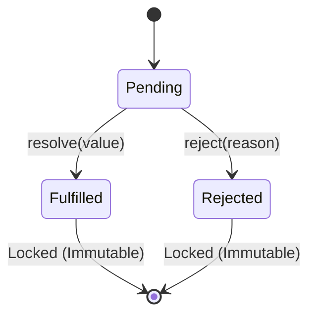

# Promises Mechanics & Combinators

## 1. 💡 Intuition & ELI5 Analogy

Imagine ordering food at a restaurant counter. The cashier gives you a electronic **buzzer** (a Promise). 

1. **`pending`**: The buzzer is quiet in your hand. The kitchen is working on your food.
2. **`fulfilled`**: The buzzer lights up green. You receive your food (`value`).
3. **`rejected`**: The buzzer flashes red. The cashier tells you the kitchen ran out of ingredients (`reason`).

Crucially, **a buzzer can only trigger once**. Once it flashes green or red, its state is locked forever. If you pass your buzzer to a friend (chaining via `.then()`), your friend gets a **new buzzer** that will trigger when their task completes.

```typescript
// ❌ Naive / Broken Code: The "Async Executor" & "Promise.all Failsafe" Anti-Patterns

// Anti-Pattern 1: Async function passed to new Promise constructor
const brokenPromise = new Promise(async (resolve, reject) => {
  // If this throws synchronously before await, the constructor FAILS to catch it!
  const data = JSON.parse('invalid json'); 
  resolve(data);
}); // Throws unhandled rejection!

// Anti-Pattern 2: Unhandled failure in Promise.all
const tasks = [fetchUser(), fetchOrders(), brokenTask()];
// If brokenTask rejects, Promise.all rejects INSTANTLY, but fetchUser and fetchOrders
// continue running in the background as dangling/orphaned promises!
const results = await Promise.all(tasks);
```

---

## 2. 🔬 Deep Architectural Breakdown & Engine Mechanics

Under the hood in V8, a Promise is a C++ object containing three internal slots:

- `[[PromiseState]]`: `"pending"`, `"fulfilled"`, or `"rejected"`.
- `[[PromiseResult]]`: `undefined` while pending, holds the resolution value or rejection reason once settled.
- `[[PromiseFulfillReactions]]` / `[[PromiseRejectReactions]]`: Queues of subscriber callbacks attached via `.then()`, `.catch()`, or `.finally()`.



### Chaining Mechanics

Calling `.then(onFulfilled, onRejected)` returns a **new Promise** ($P_{new}$).

1. If $P_{orig}$ is `pending`, callbacks are queued into $P_{orig}$'s internal reaction slots.
2. When $P_{orig}$ settles, its reaction callbacks are scheduled onto the V8 **Promise Microtask Queue**.
3. When $P_{orig}$'s microtask executes:
   - If `onFulfilled` completes cleanly and returns value $x$, $P_{new}$ is resolved with $x$.
   - If `onFulfilled` returns a Promise $P_x$, $P_{new}$ adopts the state of $P_x$.
   - If `onFulfilled` throws an exception $e$, $P_{new}$ is **rejected** with $e$.

### Comparison of the 4 Static Promise Combinators

| Combinator | Resolves When... | Rejects When... | Ideal Use Case |
| :--- | :--- | :--- | :--- |
| **`Promise.all()`** | **All** inputs fulfill. Returns array of values. | **First** input rejects (Short-circuits). | Dependent batch ops where any failure renders the set invalid. |
| **`Promise.allSettled()`** | **All** inputs settle (fulfilled or rejected). | **Never** rejects (always fulfills). | Independent batch ops where you need full reporting regardless of individual failures. |
| **`Promise.race()`** | **First** input settles (fulfilled OR rejected). | **First** input settles (if it rejected first). | Timeout racing or picking whichever resource answers first. |
| **`Promise.any()`** | **First** input fulfills. | **All** inputs reject (returns `AggregateError`). | Redundant fallback fetching (e.g. try primary CDN, fallback to secondary). |

---

## 3. 💻 Complete Production Code + Line-by-Line Annotations

Save this script as `promise-exercises.ts` to experiment with Promise execution mechanics:

```typescript
import { setTimeout as sleep } from 'node:timers/promises';

// 1. Safe Promise Combinator Wrapper with Fail-Safe Isolation
async function fetchDashboardData(userId: string) {
  console.log(`📡 Fetching data for user: ${userId}`);

  const userProfileTask = sleep(50, { id: userId, name: 'Alice' });
  const metricsTask = sleep(100, { visits: 42, conversions: 5 });
  const failingServiceTask = sleep(30).then(() => {
    throw new Error('Analytics microservice offline');
  });

  // Using Promise.allSettled guarantees no short-circuit data loss
  const results = await Promise.allSettled([
    userProfileTask,
    metricsTask,
    failingServiceTask
  ]);

  const [profileRes, metricsRes, analyticsRes] = results;

  return {
    profile: profileRes.status === 'fulfilled' ? profileRes.value : null,
    metrics: metricsRes.status === 'fulfilled' ? metricsRes.value : null,
    analyticsError: analyticsRes.status === 'rejected' ? analyticsRes.reason.message : null,
  };
}

// 2. Custom Polyfill / Mini Implementation of Promise.all
export function customPromiseAll<T>(promises: Iterable<Promise<T> | T>): Promise<T[]> {
  return new Promise((resolve, reject) => {
    const items = Array.from(promises);
    if (items.length === 0) {
      resolve([]);
      return;
    }

    const results: T[] = new Array(items.length);
    let completedCount = 0;

    items.forEach((item, index) => {
      // Wrap non-promise values safely via Promise.resolve
      Promise.resolve(item)
        .then((value) => {
          results[index] = value; // Preserve index order regardless of resolution timing
          completedCount += 1;

          if (completedCount === items.length) {
            resolve(results);
          }
        })
        .catch((err) => {
          reject(err); // Reject immediately on first error
        });
    });
  });
}

// Quick Test Execution
async function run() {
  const dashboard = await fetchDashboardData('usr_100');
  console.log('📊 Dashboard Result:', dashboard);

  console.log('🧪 Testing customPromiseAll...');
  const customRes = await customPromiseAll([
    Promise.resolve(10),
    sleep(20, 20),
    30
  ]);
  console.log('✅ Custom Promise.all Output:', customRes);
}

run();
```

---

## 4. ⚠️ Real-World Failure Modes & Security Edge Cases

### 1. `new Promise(async (resolve, reject) => ...)` Anti-Pattern
Passing an `async` function to `new Promise` constructor is dangerous. If synchronous code before the first `await` throws an error, or if an unhandled promise rejection occurs inside the executor, the `new Promise` constructor will **not** reject automatically.
- **Rule**: Never pass `async` functions to `new Promise()`. Keep promise constructors synchronous and wrap async logic in standard `async/await` functions.

### 2. Dangling / Orphaned Requests on `Promise.all` Rejection
When `Promise.all([p1, p2, p3])` fails because `p1` rejects, `Promise.all` rejects immediately. However, `p2` and `p3` continue executing in the background. If `p2` or `p3` perform database mutations or file writes, they will execute silently out of sync.
- **Rule**: If tasks in a batch have side-effects, use `Promise.allSettled()` or integrate explicit cancellation via `AbortController`.

### 3. Floating Promises (Forgotten `await`)
Calling an async function or returning a Promise without `await` or `.catch()` creates a "floating promise". Any rejection inside will trigger Node's process-level `unhandledRejection` event, which in modern Node versions will crash the application by default.

---

## 5. 🛠️ Hands-On Guided Exercise & Reference Solution

### The Challenge

Implement `mapConcurrent<T, R>(items: T[], limit: number, fn: (item: T) => Promise<R>): Promise<R[]>`:
1. Transforms an array of `items` using an async `fn`.
2. Restricts max active concurrent executions to `limit`.
3. Preserves the exact array order of the results in the returned `Promise<R[]>`.
4. Rejects immediately if any item mapping fails.

### Reference Solution

```typescript
/**
 * Maps an array asynchronously with a concurrency cap while preserving output ordering.
 */
export function mapConcurrent<T, R>(
  items: T[],
  limit: number,
  fn: (item: T) => Promise<R>
): Promise<R[]> {
  return new Promise((resolve, reject) => {
    if (items.length === 0) {
      resolve([]);
      return;
    }

    const results: R[] = new Array(items.length);
    let nextIndex = 0;
    let completedCount = 0;
    let hasFailed = false;

    function launchNextWorker() {
      if (hasFailed || nextIndex >= items.length) {
        return;
      }

      const currentIndex = nextIndex;
      nextIndex += 1;

      Promise.resolve(fn(items[currentIndex]))
        .then((result) => {
          if (hasFailed) return;
          
          results[currentIndex] = result;
          completedCount += 1;

          if (completedCount === items.length) {
            resolve(results);
          } else {
            launchNextWorker(); // Launch next item task on same slot
          }
        })
        .catch((err) => {
          hasFailed = true;
          reject(err);
        });
    }

    // Spawn initial pool up to limit
    const initialWorkers = Math.min(limit, items.length);
    for (let i = 0; i < initialWorkers; i += 1) {
      launchNextWorker();
    }
  });
}

// Quick Test Demonstration:
async function testMapConcurrent() {
  const ids = [1, 2, 3, 4, 5];
  
  console.log('⏳ Running mapConcurrent with limit = 2...');
  const results = await mapConcurrent(ids, 2, async (id) => {
    console.log(`  -> Start processing item ${id}`);
    await new Promise((r) => setTimeout(r, 100));
    console.log(`  <- Finished processing item ${id}`);
    return id * 10;
  });

  console.log('✅ Concurrency Map Results:', results); // [10, 20, 30, 40, 50]
}

testMapConcurrent();
```
