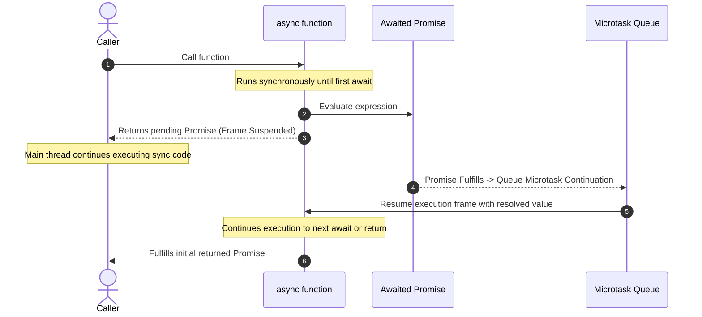

# Async / Await Mechanics

## 1. 💡 Intuition & ELI5 Analogy

Imagine reading a complex recipe book while baking a cake.

- **Synchronous code**: Mixing flour and sugar. You stay at the counter and perform the actions continuously.
- **`await` operation**: Putting the cake in the oven for 30 minutes. 
  Instead of standing in front of the oven staring at it for 30 minutes (which would be **thread-blocking**), you place a bookmark in your recipe book on page 4, step 3. You walk away from the counter and do other household chores (servicing other HTTP requests and I/O events). 
  When the oven timer rings (the Promise resolves), a microtask notifies you, and you return to page 4, step 3 to resume baking.

```typescript
// ❌ Naive / Broken Code: The Sequential Waterfall & async forEach Traps

// Anti-Pattern 1: The async forEach Trap
async function processUsersBroken(userIds: string[]) {
  // Array.prototype.forEach IS NOT ASYNC-AWARE!
  // This fires all updates concurrently without waiting for ANY of them to complete.
  userIds.forEach(async (id) => {
    await updateDatabase(id);
  });
  console.log('All users updated!'); // PRINTS IMMEDIATELY BEFORE ANY UPDATE FINISHES!
}

// Anti-Pattern 2: The Sequential Waterfall Trap
async function fetchDashboardData(userId: string) {
  // Independent requests executed sequentially (3x slower than necessary!)
  const user = await fetchUser(userId);       // Waits 100ms
  const orders = await fetchOrders(userId);   // Waits 100ms
  const stats = await fetchStats(userId);     // Waits 100ms
  return { user, orders, stats };             // Total delay = 300ms!
}
```

---

## 2. 🔬 Deep Architectural Breakdown & Engine Mechanics

### Desugaring: How `async`/`await` Transpiles to Generators + Promises

Under the hood in V8, `async/await` is syntax sugar built on top of **Generators** (`function*` / `yield`) combined with automated Promise resolution microtask handlers.

```typescript
// HIGH LEVEL: What you write:
async function getData() {
  const user = await fetchUser();
  return user.name;
}

// ENGINE LEVEL: How V8 conceptually desugars and executes it:
function getDataDesugared() {
  return spawn(function* () {
    const user = yield fetchUser();
    return user.name;
  });
}
```

### The 4 Execution Steps of an `async` Function

1. **Synchronous Execution Start**: When an `async` function is called, it executes **synchronously** up to the very first `await` expression.
2. **Evaluation & Wrapping**: The expression after `await` is evaluated. If it is not a Promise, V8 wraps it in `Promise.resolve(value)`.
3. **Frame Suspension & Stack Return**: V8 suspends the execution frame of the function (storing local variables, register state, and program counter offset). The function immediately returns a `pending` Promise to its original caller.
4. **Resumption via Microtask Queue**: When the awaited Promise settles:
   - If fulfilled: V8 queues a microtask to resume the generator execution frame, passing the resolved value into the assigned variable.
   - If rejected: V8 queues a microtask to resume execution by throwing the rejection reason inside the function frame (which can be caught with standard `try/catch`).



---

## 3. 💻 Complete Production Code + Line-by-Line Annotations

Save this file as `async-await-trace.ts` to inspect execution boundaries and implement a custom Generator coroutine runner:

```typescript
import { setTimeout as sleep } from 'node:timers/promises';

// 1. Custom Coroutine Runner showing how V8 executes async/await under the hood
function spawnCoroutine<T>(generatorFn: () => Generator<any, T, any>): Promise<T> {
  return new Promise((resolve, reject) => {
    const iterator = generatorFn();

    function step(verb: 'next' | 'throw', arg?: any) {
      let result: IteratorResult<any, T>;
      try {
        result = iterator[verb](arg);
      } catch (err) {
        reject(err);
        return;
      }

      if (result.done) {
        resolve(result.value);
        return;
      }

      // Wrap yield value in Promise.resolve and subscribe resumption handlers
      Promise.resolve(result.value)
        .then((val) => step('next', val))
        .catch((err) => step('throw', err));
    }

    step('next'); // Kick off synchronous execution
  });
}

// 2. Trace execution order between sync code and async suspension
async function traceExecution() {
  console.log('2: [Sync] Inside async function (before await)');

  // Expression evaluated; execution frame suspended HERE!
  const data = await sleep(50, 'Result Data');

  console.log(`4: [Resumed via Microtask] After await: ${data}`);
  return data;
}

// Run comparison test
console.log('1: [Sync] Before traceExecution call');

const promiseResult = traceExecution();

console.log('3: [Sync] After traceExecution call (Synchronous stack clear)');

// Test custom coroutine spawn
spawnCoroutine(function* () {
  console.log('5: [Coroutine Sync] Generator start');
  const user = yield sleep(20, { name: 'Bob' });
  console.log(`6: [Coroutine Resumed] Fetched user: ${user.name}`);
  return user;
}).then((user) => {
  console.log(`7: [Coroutine Fulfill] Final output: ${user.name}`);
});
```

### Execution Output & Rationale

```text
1: [Sync] Before traceExecution call
2: [Sync] Inside async function (before await)
3: [Sync] After traceExecution call (Synchronous stack clear)
5: [Coroutine Sync] Generator start
4: [Resumed via Microtask] After await: Result Data
6: [Coroutine Resumed] Fetched user: Bob
7: [Coroutine Fulfill] Final output: Bob
```

---

## 4. ⚠️ Real-World Failure Modes & Security Edge Cases

### 1. Express / Middleware Unhandled Async Exception Trap
In older Express 4 applications, throwing an exception inside an `async` route handler returns a rejected Promise. Because Express 4 expects synchronous errors or explicit calls to `next(err)`, the thrown exception is **completely ignored by Express** and triggers Node's `unhandledRejection` process crash!

```typescript
// ❌ Dangerous in Express 4:
app.get('/user', async (req, res) => {
  const user = await db.getUser(req.query.id); // If db throws, process crashes!
  res.json(user);
});

// ✅ Fix for Express 4: Wrap in try/catch or use express-async-errors wrapper
app.get('/user', async (req, res, next) => {
  try {
    const user = await db.getUser(req.query.id);
    res.json(user);
  } catch (err) {
    next(err); // Pass error to Express middleware
  }
});
```

### 2. Awaiting Synchronous Primitive Values in Tight Loops
Writing `await 5` inside a loop with 1,000,000 iterations forces V8 to wrap the primitive `5` into `Promise.resolve(5)` and schedule 1,000,000 microtasks. This degrades performance by 100x compared to standard synchronous calculation.

### 3. Mixing `async/await` with `Array.prototype.map` without `Promise.all`
Calling `items.map(async (item) => ...)` returns an array of pending Promises `[Promise <pending>, Promise <pending>]`. Forgetting to wrap the mapped result in `await Promise.all(...)` leads to subtle logic bugs where processing is incomplete.

---

## 5. 🛠️ Hands-On Guided Exercise & Reference Solution

### The Challenge

Implement a robust `retryAsync<T>` function:
```typescript
interface RetryOptions {
  retries: number;
  backoffMs: number;
  onRetry?: (error: unknown, attempt: number) => void;
}

export async function retryAsync<T>(
  fn: () => Promise<T>,
  options: RetryOptions
): Promise<T>
```
Requirements:
1. Retries the async function `fn` up to `retries` times if it throws or rejects.
2. Uses exponential backoff delay (`backoffMs * 2^(attempt - 1)`).
3. If all attempts fail, re-throws the final error with standard error context.

### Reference Solution

```typescript
import { setTimeout as sleep } from 'node:timers/promises';

interface RetryOptions {
  retries: number;
  backoffMs: number;
  onRetry?: (error: unknown, attempt: number) => void;
}

/**
 * Retries an asynchronous operation with exponential backoff.
 */
export async function retryAsync<T>(
  fn: () => Promise<T>,
  options: RetryOptions
): Promise<T> {
  const { retries, backoffMs, onRetry } = options;
  let lastError: unknown;

  for (let attempt = 1; attempt <= retries + 1; attempt += 1) {
    try {
      return await fn(); // If successful, returns value immediately
    } catch (err) {
      lastError = err;

      if (attempt > retries) {
        break; // Out of attempts
      }

      if (onRetry) {
        onRetry(err, attempt);
      }

      // Calculate exponential backoff: base * 2^(attempt - 1)
      const delay = backoffMs * Math.pow(2, attempt - 1);
      await sleep(delay);
    }
  }

  throw lastError;
}

// Quick Test Demonstration:
async function demoRetry() {
  let attempts = 0;

  console.log('🔄 Starting operation with retry logic...');
  
  try {
    const data = await retryAsync(
      async () => {
        attempts += 1;
        console.log(`  -> Attempt ${attempts} executing...`);
        if (attempts < 3) {
          throw new Error(`Transient network failure on attempt ${attempts}`);
        }
        return 'Success Data!';
      },
      {
        retries: 3,
        backoffMs: 50,
        onRetry: (err, attempt) => {
          console.warn(`  ⚠️ Warning: Attempt ${attempt} failed. Retrying...`);
        },
      }
    );

    console.log(`✅ Result: ${data}`);
  } catch (err: any) {
    console.error(`❌ Final Failure: ${err.message}`);
  }
}

demoRetry();
```
