# V8 Heap Structure

The V8 engine manages Node.js runtime memory by segmenting the heap into distinct memory spaces based on object size, lifetime, and purpose. This layout allows V8 to isolate short-lived allocations from long-lived server singletons, optimizing garbage collection efficiency.

---

## 1. Core Heap Spaces Breakdown

```mermaid
flowchart TD
    subgraph V8 Heap Memory
        subgraph New Space ["New Space (Young Generation: 1MB - 64MB)"]
            FromSpace["From-Space (Active Allocations)"]
            ToSpace["To-Space (GC Target)"]
        end
        
        subgraph Old Space ["Old Space (Old Generation)"]
            OldPointer["Old Pointer Space (Objects with refs)"]
            OldData["Old Data Space (Raw data: strings, buffers)"]
        end
        
        LargeObject["Large Object Space (Allocations > space limit)"]
        CodeSpace["Code Space (JIT Compiled Machine Code)"]
        MapSpace["Map Space (Hidden Classes / Object Shapes)"]
    end
```

### 1. New Space (Young Generation)
- **Size**: Typically small (1 MB – 64 MB).
- **Purpose**: Where almost all new objects are allocated first using fast pointer-bumping.
- **Structure**: Divided into two equal halves called **Semi-Spaces**: `From-Space` and `To-Space`.
- **Behavior**: Extremely volatile. Most objects created in Node.js (e.g., intermediate request payloads, temporary function scope variables) die here during minor GC sweeps (Scavenger algorithm).

### 2. Old Space (Old Generation)
- **Purpose**: Houses long-lived objects that survived two Scavenger GC cycles in the New Space.
- **Sub-divisions**:
  - **Old Pointer Space**: Contains promoted objects that hold references to other objects.
  - **Old Data Space**: Contains raw data payloads (strings, boxed numbers, raw byte arrays) without outgoing object pointers. Separating pointers from raw data speeds up GC scanning since raw data spaces don't need pointer tracing.

### 3. Large Object Space
- **Purpose**: Holds allocations that exceed the size capacity of the New Space.
- **Behavior**: Objects here bypass the New Space entirely and are allocated directly into Large Object Space. They are never moved by garbage collection cycles, avoiding expensive memory copies.

### 4. Code Space & Map Space
- **Code Space**: Reserved for executable machine code generated by V8's JIT compiler (Ignition bytecodes and TurboFan optimized machine instructions).
- **Map Space**: Contains V8 "Hidden Classes" (Maps) that define object shapes and property offsets for fast property lookups.

---

## 2. Key Metrics & Production Context

In production, memory management tools and metrics monitor these spaces:

- **Resident Set Size (RSS)**: Total process memory allocated from the OS, including the V8 heap, C++ bindings, code execution stack, and ArrayBuffers.
- **Heap Total**: Total size committed by V8 from OS memory for the heap spaces above.
- **Heap Used**: Actual memory consumed by active JS objects inside the heap spaces.
- **`--max-old-space-size`**: Node.js CLI flag that sets the maximum memory limit for the Old Space (defaults to ~2GB or ~4GB depending on architecture/V8 version).
