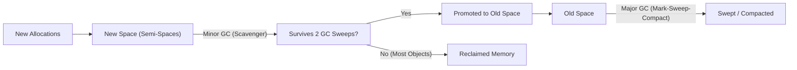
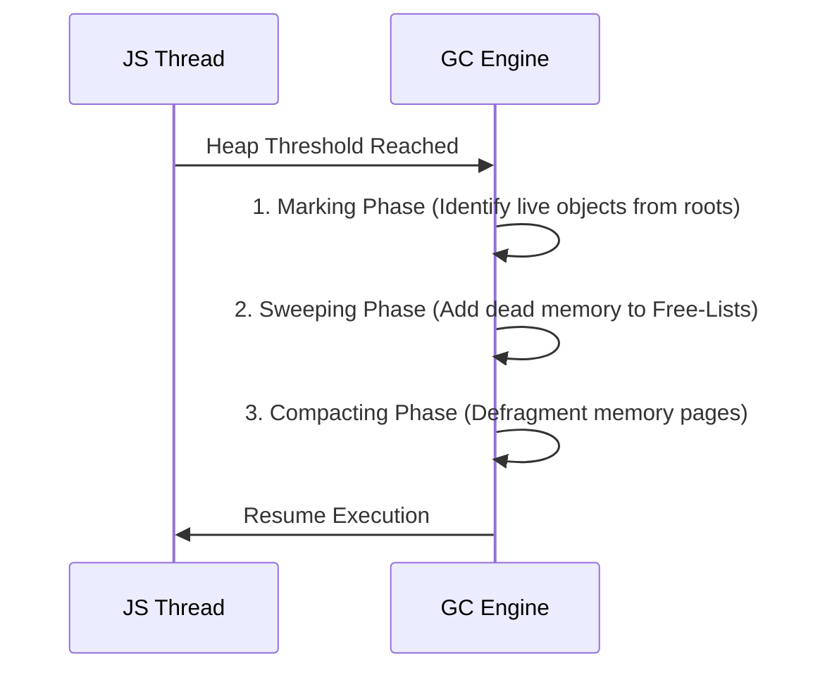

# GC Algorithms

V8 manages runtime memory and prevents memory exhaustion using two primary garbage collection strategies: **Minor GC (Scavenger)** for short-lived allocations and **Major GC (Mark-Sweep-Compact)** for long-lived data structures.

---

## 1. The Generational Hypothesis

Garbage collection in V8 is built on the **Generational Hypothesis**: the statistical reality in software runtime systems that *most objects die shortly after creation*. Intermediate JSON objects, temporary string allocations, and function-scoped variables exist for milliseconds. V8 leverages this by splitting GC into two distinct engines.

---

## 2. Minor GC: The Scavenger Algorithm (Cheney's Copying Algorithm)

Minor GC targets only the **New Space** (Young Generation) and runs frequently (often every few tens of milliseconds under high throughput).

- **Semi-Space Split**: The New Space is divided into `From-Space` and `To-Space`.
- **Allocation**: New objects are allocated into `From-Space` sequentially using a fast pointer increment (pointer-bumping).
- **Copy Phase**: When `From-Space` fills up, a Scavenge cycle triggers:
  1. V8 traverses root pointers to locate active, reachable objects in `From-Space`.
  2. Reachable objects are copied directly into contiguous memory in `To-Space`.
  3. Unreachable objects are simply ignored—no explicit deallocation or sweeping is needed.
- **Role Swap**: The roles of `From-Space` and `To-Space` swap instantly.
- **Tenuring / Promotion**: Objects that survive two consecutive Scavenger cycles are promoted (moved) into the **Old Space**.

---

## 3. Major GC: Mark-Sweep-Compact

Major GC targets the entire heap (especially **Old Space**) when Old Space exceeds allocated boundaries or allocation rate thresholds.

Major GC operates in three sequential phases:

### Phase 1: Marking (Tri-color Marking)
- Objects are treated as nodes in a graph.
- V8 uses **Tri-color Marking** (White = unvisited/dead candidate, Grey = visited but children unvisited, Black = visited and reachable).
- The collector traverses all root references (global object, active stack frames) to discover all live objects.

### Phase 2: Sweeping
- The collector scans un-marked (White) memory slots and adds their memory addresses back into **Free-Lists**.
- Free-lists organize vacant memory blocks by size so future allocations in Old Space can quickly locate matching slots.

### Phase 3: Compacting
- Over time, sweeping leaves Old Space fragmented (holes between allocated objects).
- Compacting shifts live objects together into contiguous memory blocks to eliminate fragmentation and prevent allocation failures.

---

## 4. Reducing Pause Times: Incremental & Concurrent GC

Traditional GC causes "Stop-The-World" (STW) pauses, halting Node.js event loop processing while traversing the heap graph. Modern V8 minimizes STW pauses using concurrent strategies:

| Strategy | Description | Impact on Event Loop |
| :--- | :--- | :--- |
| **Incremental Marking** | Breaks marking into small micro-steps interleaved between JS task execution. | Reduces maximum single STW pause time from 100ms+ down to ~5-10ms. |
| **Concurrent Marking** | Helper C++ threads trace object pointers in the background while main JS thread executes. | Uses multi-core capabilities without blocking the main event loop. |
| **Concurrent Sweeping/Swapping** | Background threads free dead memory pages asynchronously after marking completes. | Main thread resumes execution immediately after marking. |

---

## 5. Production Relevance & APM Insights

- **Latency Spikes**: High allocation rates in Node.js services trigger frequent Major GC sweeps, visible in APM metrics (Datadog, New Relic) as periodic p99/p999 latency spikes.
- **Node.js Flags**:
  - `--trace-gc`: Logs every Minor and Major GC event with timing metrics to stdout.
  - `--max-old-space-size`: Adjusts when Major GC triggers to prevent prematurely triggering expensive compaction rounds.
