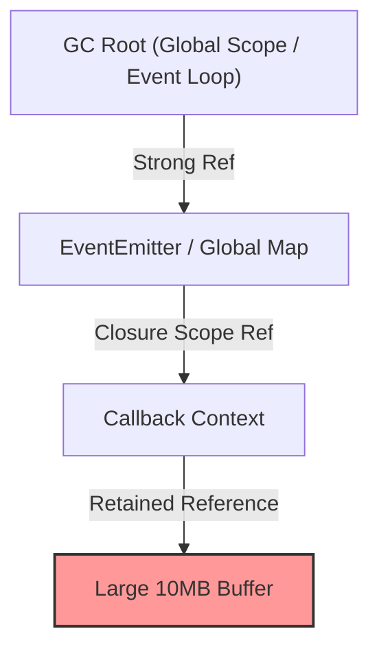

# Memory Leak Patterns in Node.js

> **Mode**: BUILD | **Anchor**: T1-CLI | **Artifact**: `leak-repro.ts` | **Ref**: T6

---

## 1. 💡 Intuition & ELI5 Analogy

Think of V8's Garbage Collector like a trash collection service that only picks up items that have no physical ropes tied to your house. A memory leak in Node.js doesn't mean memory disappears into thin air—it means your code left invisible "ropes" (references) holding onto object allocations long after your application logic is finished with them. Because V8 can trace a path from a root object (like `globalThis`, a module-level variable, or an active event listener) to that memory, the Garbage Collector assumes you still need it and refuses to clean it up.

Here is the classic "unbounded cache" leak:

```typescript
// ❌ Naive/Broken: Global Map that grows infinitely over process lifespan
const requestCache = new Map<string, any>();

function handleRequest(userId: string, data: any) {
  // Every request attaches a new payload to the global Map
  requestCache.set(userId, data); 
  // Map keeps a strong reference to 'data' forever!
  return { status: "success" };
}
```

---

## 2. 🔬 Deep Architectural Breakdown & Engine Mechanics

In V8, memory reclamation is entirely based on **reachability**, not scope termination. If an object is reachable via reference-chain traversal from a **GC Root** (active stack frames, global objects, module scope exports), it will survive GC cycles regardless of whether your logic will ever access it again.



### The 4 Major Node.js Leak Patterns:

1. **Unbounded Caches / In-Memory Maps**:
   - `Map` and `Set` maintain strong references to both keys and values.
   - Without key eviction policies (TTL, LRU) or maximum size bounds, memory consumption grows linearly with incoming traffic until process crash (OOMKill).

2. **Dangling Closures & Shared Lexical Scope**:
   - In V8, functions created in the same outer scope share a single **Context** object.
   - If one inner function escapes into a long-lived object (e.g., an interval or global handler), it retains the *entire* outer context object—including unrelated large variables declared in that outer function.

3. **Event Listener Leaks (`EventEmitter`)**:
   - `emitter.on('event', listener)` pushes the `listener` function into the emitter's internal array of handlers.
   - If the `emitter` is long-lived (e.g., a singleton HTTP server or socket connection) and handlers are added per-request without `emitter.off()`, every request leaves a callback (and its enclosed scope) anchored in memory.

4. **Retained Streams & Unclosed Handles**:
   - Creating `fs.createReadStream()` or socket connections without consuming them or handling error/close events leaves internal buffers (e.g., `highWaterMark` chunk buffers) pinned in Old Space memory.

---

## 3. 💻 Complete Production Code + Line-by-Line Annotations

Below is `leak-repro.ts`, demonstrating the 4 common leak patterns alongside their safe, production-grade resolutions.

```typescript
import { EventEmitter } from "node:events";

// Global singleton emitter simulating a long-lived system service
const globalBus = new EventEmitter();

// ==========================================
// PATTERN 1: Unbounded Cache vs WeakMap / LRU
// ==========================================

// ❌ LEAK: Strong references prevent GC reclamation
const unsafeCache = new Map<object, Buffer>();

// ✅ SAFE: WeakMap allows key objects to be garbage collected when unreferenced elsewhere
const safeCache = new WeakMap<object, Buffer>();

export function cacheUserSession(sessionKey: object) {
  const payload = Buffer.alloc(1024 * 1024); // 1 MB payload
  safeCache.set(sessionKey, payload);
}

// ==========================================
// PATTERN 2: Shared Lexical Scope Closure Leak
// ==========================================

let closureLeakHolder: (() => void) | null = null;

export function simulateClosureLeak() {
  // Large allocation inside outer scope
  const hugeBuffer = Buffer.alloc(10 * 1024 * 1024); // 10 MB

  // Function A: Uses hugeBuffer
  const unusedFunction = function () {
    if (hugeBuffer) console.log("Buffer exists");
  };

  // Function B: Escapes to outer scope! Does NOT use hugeBuffer directly,
  // BUT shares the lexical context object with unusedFunction, pinning hugeBuffer!
  closureLeakHolder = function () {
    console.log("Leaky callback executed");
  };
}

export function fixClosureLeak() {
  const hugeBuffer = Buffer.alloc(10 * 1024 * 1024);
  
  // Extract only primitive or required variables into the escaping closure
  const bufferSize = hugeBuffer.length;

  closureLeakHolder = function () {
    console.log(`Buffer size was ${bufferSize}`);
  };
  // hugeBuffer reference is now eligible for GC after fixClosureLeak returns!
}

// ==========================================
// PATTERN 3: EventEmitter Listener Leaks
// ==========================================

export function handleRequestLeaky(requestId: string) {
  const requestData = Buffer.alloc(2 * 1024 * 1024); // 2 MB per request

  // ❌ LEAK: Adding listener to globalBus on every request without removing it
  globalBus.on("config-updated", () => {
    console.log(`Request ${requestId} updated with data size ${requestData.length}`);
  });
}

export function handleRequestSafe(requestId: string) {
  const requestData = Buffer.alloc(2 * 1024 * 1024);

  const onUpdate = () => {
    console.log(`Request ${requestId} updated with data size ${requestData.length}`);
  };

  globalBus.on("config-updated", onUpdate);

  // ✅ SAFE: Always clean up event listeners when work scope finishes (or use AbortSignal)
  return () => {
    globalBus.removeListener("config-updated", onUpdate);
  };
}
```

---

## 4. ⚠️ Real-World Failure Modes & Security Edge Cases

1. **Kubernetes OOMKills (`Exit Code 137`)**:
   - A container with a 512MB RAM limit experiences a 1MB per minute memory leak. Once RSS reaches 512MB, the Linux kernel OOM killer sends `SIGKILL` without firing Node process shutdown handlers or generating stack traces.

2. **Dangling Database Connections & Connection Pools**:
   - Leaving unclosed transactions or unreleased client connections from a pool retains socket buffers in memory, eventually exhausting max database connections.

3. **MaxListenersExceededWarning**:
   - Node emit warnings when an `EventEmitter` accumulates >10 listeners. Ignoring this warning usually indicates an active memory leak in production.

4. **Global Proxy / Patching Libraries**:
   - APM agents or logging libraries that monkey-patch global methods (`http.request`) without clearing context objects cause silent process-wide memory growth.

---

## 5. 🛠️ Hands-On Guided Exercise & Reference Solution

### Exercise Goal
Identify the memory leak in the function below and rewrite it to prevent memory accumulation.

```typescript
// Exercise Input Code:
const metricEmitter = new EventEmitter();

function trackMetrics(metricName: string) {
  const payload = { timestamp: Date.now(), data: new Array(100000).fill("x") };
  
  metricEmitter.on("flush", () => {
    console.log(`Flushing ${metricName}:`, payload.data.length);
  });
}
```

---

### Reference Solution

```typescript
const metricEmitter = new EventEmitter();

function trackMetrics(metricName: string) {
  const payload = { timestamp: Date.now(), data: new Array(100000).fill("x") };

  // Use .once() for single-shot execution or AbortController / explicit removal
  const handler = () => {
    console.log(`Flushing ${metricName}:`, payload.data.length);
  };

  metricEmitter.once("flush", handler);
}
```
