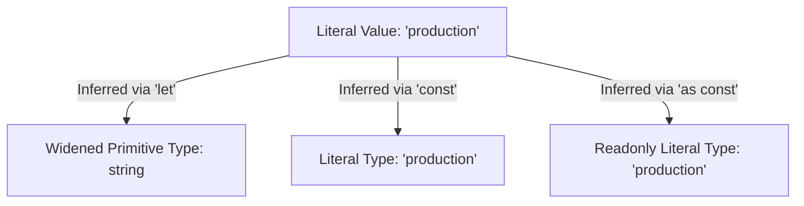

# Primitive & Literal Types

> **Mode**: BUILD | **Anchor**: T1-CLI | **Artifact**: `primitives.ts` | **Ref**: T1.6

---

## 1. 💡 Intuition & ELI5 Analogy

Think of TypeScript types as stencil outlines. A broad type like `string` or `number` is a wide box—any text or numeric value fits inside. A **literal type**, however, is a precise cutout shaped like a specific value (such as `"GET"`, `404`, or `true`).

When you declare a variable with `let`, TypeScript assumes you intend to reassign it later, so it **widens** the type from a specific literal (`"production"`) to its broader primitive (`string`). When you use `const` or `as const`, TypeScript locks down the exact literal value.

```typescript
// ❌ Naive/Broken: Type widening loses literal intent
let httpMethod = "GET"; // Type widened to string

function sendRequest(method: "GET" | "POST") {
  // ...
}

// ❌ TypeScript Error: Argument of type 'string' is not assignable to parameter of type '"GET" | "POST"'.
sendRequest(httpMethod);
```

---

## 2. 🔬 Deep Architectural Breakdown & Engine Mechanics

TypeScript's type checker evaluates type declarations using structural subtyping and widening rules during type inference:



### Primitives in TypeScript:
- **`string`**, **`number`**, **`boolean`**: Standard JS primitives.
- **`null`** & **`undefined`**: Represent absence of value (under `strictNullChecks: true`, they are distinct types not assignable to others).
- **`symbol`**: Unique immutable identifiers created via `Symbol()`.
- **`bigint`**: Arbitrary-precision integers (`100n`).

### Type Widening vs `as const` Assertions:
1. **`let` vs `const`**:
   - `let x = "GET"` -> `x` has type `string`.
   - `const x = "GET"` -> `x` has type `"GET"`.
2. **Object Property Widening**:
   - `const config = { env: "production" }` -> `config.env` has type `string` (because properties of a mutable object can be reassigned).
   - `const config = { env: "production" } as const` -> `config.env` has type `"production"` and `config` becomes `readonly { readonly env: "production" }`.

---

## 3. 💻 Complete Production Code + Line-by-Line Annotations

Below is `primitives.ts`, demonstrating primitive typing, narrowing, literal unions, and `as const` assertions.

```typescript
// ==========================================
// 1. Primitive & Literal Type Declarations
// ==========================================

// Explicit primitive types
const port: number = 8080;
const host: string = "127.0.0.1";
const debugMode: boolean = false;
const maxConnections: bigint = 9007199254740991n;
const processId: symbol = Symbol("process.id");

// Discriminated / Union Literal Types
type LogLevel = "debug" | "info" | "warn" | "error";
type HttpStatusCode = 200 | 201 | 400 | 404 | 500;

// Function consuming literal union
export function logMessage(level: LogLevel, status: HttpStatusCode, message: string): void {
  console.log(`[${level.toUpperCase()}] HTTP ${status}: ${message}`);
}

// ==========================================
// 2. Object Widening & 'as const' Assertions
// ==========================================

// ❌ WIDENED CONFIG OBJECT:
// Properties widen to string/number because 'config' properties are mutable
const mutableConfig = {
  env: "production", // type: string
  port: 3000,        // type: number
  allowedMethods: ["GET", "POST"], // type: string[]
};

// ❌ Compiler Error: mutableConfig.env is 'string', not '"production"'
// logMessage("info", 200, mutableConfig.env);

// ✅ READONLY LITERAL CONFIG OBJECT:
// 'as const' creates deeply immutable literal types
const immutableConfig = {
  env: "production",
  port: 3000,
  allowedMethods: ["GET", "POST"],
} as const;

// Types derived from immutableConfig:
// env: "production"
// port: 3000
// allowedMethods: readonly ["GET", "POST"]

export function getAppEnvironment(): typeof immutableConfig.env {
  return immutableConfig.env; // Returns exact literal type "production"
}
```

---

## 4. ⚠️ Real-World Failure Modes & Security Edge Cases

1. **Unintentional Type Widening in Options Bags**:
   - Passing plain objects into configuration handlers causes TypeScript to infer generic `string` or `number` properties, breaking function APIs expecting strict literal values.

2. **Assuming `const` Recursively Freezes Property Types**:
   - `const obj = { method: "POST" }` freezes the binding of `obj`, but NOT its nested properties (`obj.method` is still typed as `string`). `as const` is mandatory for nested literal preservation.

3. **`NaN` and `Infinity` as `number`**:
   - Both `NaN` and `Infinity` have the primitive type `number` in TypeScript. TypeScript does not catch div-by-zero or `NaN` math at compile-time.

4. **Bypassing Strict Null Checks**:
   - Disabling `strictNullChecks` allows `null` and `undefined` to be assigned to any string or number variable, causing runtime `Cannot read property of undefined` crashes.

---

## 5. 🛠️ Hands-On Guided Exercise & Reference Solution

### Exercise Goal
Fix the type compilation error in `serverConfig` without changing the function signature of `startServer`.

```typescript
// Exercise Input Code:
function startServer(protocol: "http" | "https", port: 80 | 443 | 8080) {
  console.log(`Starting ${protocol} server on port ${port}`);
}

const serverConfig = {
  protocol: "https",
  port: 8080,
};

// ❌ ERROR: Argument of type 'string' is not assignable to parameter of type '"http" | "https"'
startServer(serverConfig.protocol, serverConfig.port);
```

---

### Reference Solution

```typescript
function startServer(protocol: "http" | "https", port: 80 | 443 | 8080) {
  console.log(`Starting ${protocol} server on port ${port}`);
}

// Fix: Add 'as const' to prevent type widening on object properties
const serverConfig = {
  protocol: "https",
  port: 8080,
} as const;

startServer(serverConfig.protocol, serverConfig.port); // ✅ Compiles cleanly!
```
